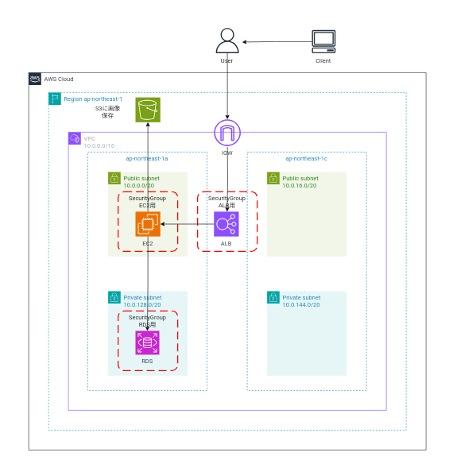

## AWS CLIを使用して、環境を構築する
* AWS CLIを使用したAWSリソースの環境構築及び変更、削除コマンドをCLIで操作した備忘録です!
* 構成する環境は下記の構成図の通りです！
* CLIインストール方法に関しては、お使いのPCによって異なりますので、[公式サイト](https://docs.aws.amazon.com/ja_jp/cli/latest/userguide/getting-started-install.html)を参考にインストールお願いします！

## 作成する構成図

前提事項
* CLIを操作しているIAMユーザは、””