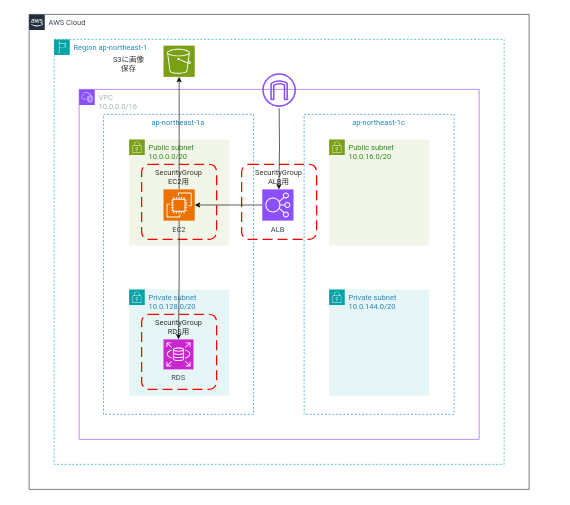
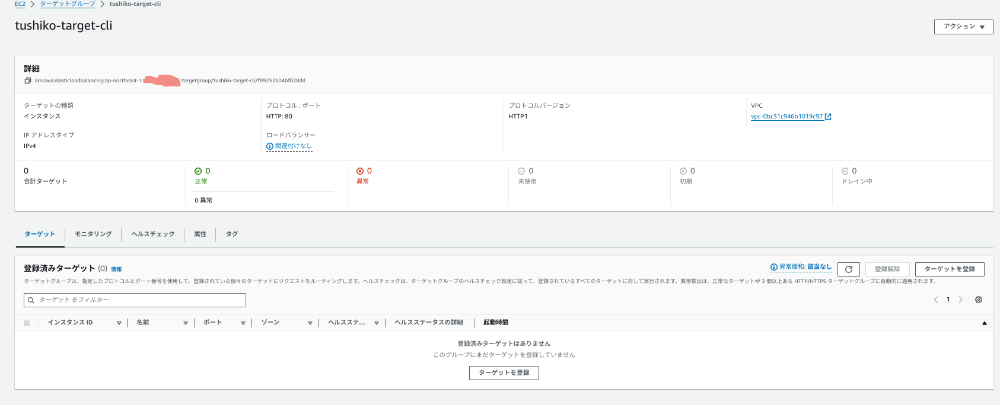
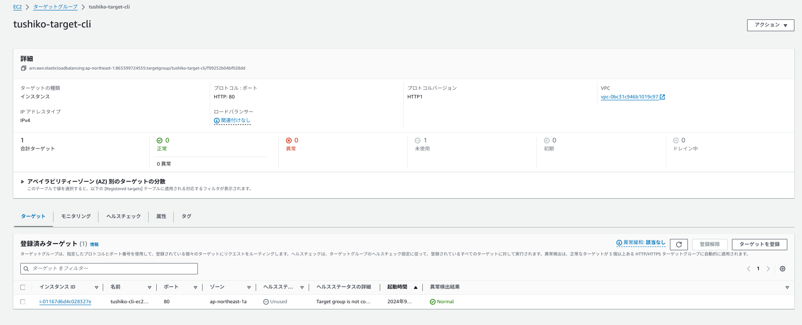
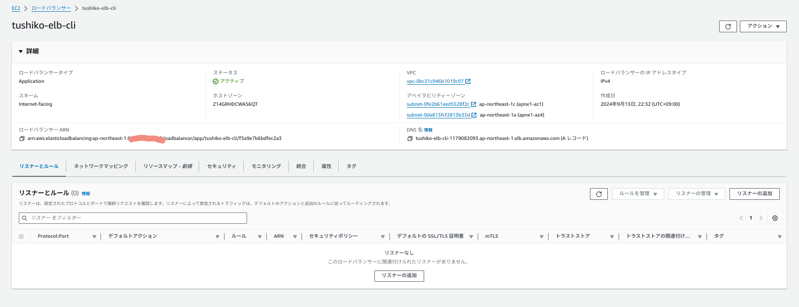
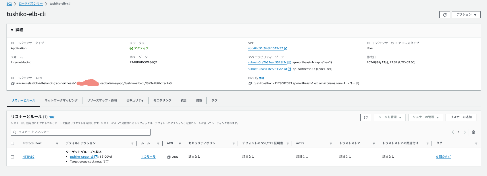
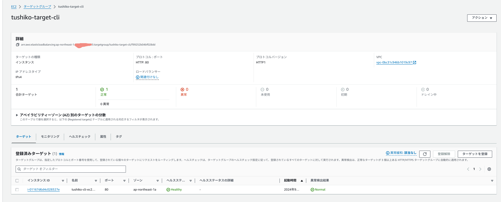

# CLIにて第5回課題環境を構築するPart.5
## 構成図


## ALB構築
### 行うこと
1. ターゲットグループの作成
2. ターゲットグループへターゲットの登録
3. ELBの作成
4. リスナー設定

##
1. ターゲットグループの作成

#### 各種変数を設定

* ①ターゲットグループ名
  * 設定したいターゲットグループを設定
```
TARGET_GROUP_NAME=tushiko-target-cli
```
* ②ターゲットグループのプロトコル
```
TARGET_GROUP_PROTCOL=HTTP
```
* ③ターゲットグループのポート
```
TARGET_GROUP_PORT=80
```
* ④ヘルスチェックパス
```
HTALTH_CHECK_PATH=/
```

* ⑤ヘルスチェックポート
```
HTALTH_CHECK_PORT=80
```

* ⑥ヘルスチェックプロトコル
```
HTALTH_CHECK_PROTCOL=HTTP
```

* ⑦ヘルスチェックの間隔(秒)
```
HTALTH_CHECK_INTERVAL=30
```
* ⑧ヘルスチェックのタイムアウト値(秒)
```
HTALTH_CHECK_TIMEOUT=5
```
* ⑨正常と判断する閾値
```
HTALTHY_THRESHOLD_COUNT=5
```
* ⑩異常と判断する閾値
```
UNHTALTHY_THRESHOLD_COUNT=2
```
* ターゲットのタイプ(lambdaも指定できるが今回は割愛)
* ⑪インスタンスを選択
```
TARGET_TYPE=instance
```

* VPCの関連付け
* ⑫VPCタグ名
```
#自身が設定したvpcタグ
EC2_VPC_TAG_NAME='tushiko-cli-vpc'
```
* VPC ID
```
EC2_VPC_ID=$( \
  aws ec2 describe-vpcs \
    --filters Name=tag:Name,Values=${EC2_VPC_TAG_NAME}  \
    --query 'Vpcs[].VpcId' \
    --output text \
) \
  && echo ${EC2_VPC_ID}
```
```
#指定したVPC IDがでればOK
vpc-×××××××××××××××
```

#### ターゲットグループの作成
```
aws elbv2 create-target-group \
--name ${TARGET_GROUP_NAME} \
--protocol ${TARGET_GROUP_PROTCOL} \
--port ${TARGET_GROUP_PORT} \
--health-check-path ${HTALTH_CHECK_PATH} \
--health-check-protocol  ${HTALTH_CHECK_PROTCOL} \
--health-check-port ${HTALTH_CHECK_PORT} \
--health-check-interval-seconds ${HTALTH_CHECK_INTERVAL} \
--health-check-timeout-seconds ${HTALTH_CHECK_TIMEOUT} \
--healthy-threshold-count ${HTALTHY_THRESHOLD_COUNT} \
--unhealthy-threshold-count ${UNHTALTHY_THRESHOLD_COUNT} \
--target-type ${TARGET_TYPE} \
--vpc-id ${EC2_VPC_ID}
```

* ターゲットグループの存在確認

```
aws elbv2 describe-target-groups --names ${TARGET_GROUP_NAME}
```

コンソール上でも確認

2. ターゲット(今回はインスタンス)をターゲットグループに登録

インスタンスIDを取得　(今回は、直前で作成したインスタンスIDを確認するコマンドを使用して取得)

```
aws ec2 describe-instances \
  --query 'Reservations[*].Instances[*].[InstanceId, LaunchTime]' \
  --output text | sort -k2 | tail -n 1 | awk '{print $1}'
```

各種変数を指定

* ①ターゲットのインスタンスID(ターゲットタイプがinsntaceの場合のみ指定)
    * 取得したインスタンスIDを設定 
```
TARGET_ID=i-×××××××××××××××××
```
* ②ターゲットのポート
```
TARGET_PORT=80
```
* ③ELBの名前
    * 自身が設定するELBを指定する
```
ELB_NAME=tushiko-elb-cli
```

* ④サブネットタグ名
    * ap-northeast-1aのパブリックサブネットのタグ名を指定。自身が作成したパプリックサブネットの値を設定
```
EC2_SUBNET_TAG_NAME='tushiko-cli-public-subnet-a'
```
サブネットID

```
EC2_SUBNET_ID=$( \
  aws ec2 describe-subnets \
    --filters Name=vpc-id,Values=${EC2_VPC_ID} \
              Name=tag:Name,Values=${EC2_SUBNET_TAG_NAME} \
    --query "Subnets[].SubnetId" \
    --output text \
) \
&& echo ${EC2_SUBNET_ID}
```
```
#指定したサブネットIDが出ればOK
subnet-×××××××××××××
```

ELBを作成するサブネットIDを指定(２つのAZのSubnetを指定)

* ⑤取得したサブネットIDを指定
```
SUBETIDS="subnet-×××××××××××××××× subnet-××××××××××××××××"
```

関連付けるSGIDを取得

* ALBに関連付けるセキュリティグループ
    * 自身が作成したALBに関連付けるセキュリティグループID
```
EC2_SECURITY_GROUP_NAME='tushiko-cli-sg3'
```
* 指定されたsg-idが出るか確認
```
EC2_SECURITY_GROUP_ID=$( \
  aws ec2 describe-security-groups \
    --filters Name=vpc-id,Values=${EC2_VPC_ID} \
              Name=group-name,Values=${EC2_SECURITY_GROUP_NAME} \
    --query 'SecurityGroups[].GroupId' \
    --output text \
) \
&& echo ${EC2_SECURITY_GROUP_ID}
```
```
sg-XXXXXXXXXXXXXXX
```

* ⑥ELBにアタッチするSGID
```
##　出力したSGIDを登録
SGIDS=sg-XXXXXXXXXXXXXXX
```
* ⑦ELBのスキーマ
    * internet-facingを選択
    * SCHEME=internet-facing or internal
```
SCHEME=internet-facing
```

* ⑧ELBのタイプ
    * applicationを選択
    * ELB_TYPE=application or network
```
ELB_TYPE=application
```

* ⑨IPアドレスタイプ
```
IP_ADDRESS_TYPE=ipv4
```

* ⑩リスナーのプロトコル(HTTPの場合)
```
LISTENER_PROTCOL_HTTP=HTTP
```
* ⑪リスナーのプロトコル(HTTPの場合)
```
LISTENER_PORT_HTTP=80
```

1. ターゲットの登録

* 作業前の状態確認

```
aws elbv2 describe-target-health \
--target-group-arn $(aws elbv2 describe-target-groups --query "TargetGroups[].TargetGroupArn" --output text --name ${TARGET_GROUP_NAME}) \
--query 'TargetHealthDescriptions[].Target' --output table
```

* ターゲットの登録（ターゲットグループのタイプがinstanceの場合)

```
aws elbv2 register-targets \
--targets Id=${TARGET_ID},Port=${TARGET_PORT} \
--target-group-arn $(aws elbv2 describe-target-groups --query "TargetGroups[].TargetGroupArn" --output text --name ${TARGET_GROUP_NAME})
```
* 作業後の状態確認

```
aws elbv2 describe-target-health \
--target-group-arn $(aws elbv2 describe-target-groups --query "TargetGroups[].TargetGroupArn" --output text --name ${TARGET_GROUP_NAME}) \
--query 'TargetHealthDescriptions[].Target' --output table
```

  * 以下が返ってくればOK
```
---------------------------------
|     DescribeTargetHealth      |
+----------------------+--------+
|          Id          | Port   |
+----------------------+--------+
|  i-××××××××××××××××× |  80    |
+----------------------+--------+
```
コンソール上でも確認


1. ELB構築
* ELBが存在しない場合、エラーが返ってくる。
* 作成状態確認
```
aws elbv2 describe-load-balancers --names ${ELB_NAME}
```
* 存在しない場合のエラー
    * []内が空白になる
```
{
    "LoadBalancers": []
}
```

ELBの作成
```
aws elbv2 create-load-balancer \
--name ${ELB_NAME} \
--subnets ${SUBETIDS} \
--security-groups ${SGIDS} \
--scheme ${SCHEME} \
--type ${ELB_TYPE} \
--ip-address-type ${IP_ADDRESS_TYPE} \
--tags Key=Name,Value=${ELB_NAME}
```

以下の値が返ってくればOK！
```
{
    "LoadBalancers": [
        {
            "LoadBalancerArn": "arn:aws:elasticloadbalancing:ap-northeast-1:マイアカウントid:loadbalancer/app/指定したelb‐名/f3a9e7b6bdfec2a3",
            "DNSName": "指定したelb‐名-1179082093.リージョン.elb.amazonaws.com",
            "CanonicalHostedZoneId": "××××××××××××××",
            "CreatedTime": "2024-09-13T13:32:12.557000+00:00",
            "LoadBalancerName": "指定したelb‐名",
            "Scheme": "internet-facing",
            "VpcId": "vpc-id",
            "State": {
                "Code": "provisioning"
            },
            "Type": "application",
            "AvailabilityZones": [
                {
                    "ZoneName": "指定したリージョン",
                    "SubnetId": "subnet-×××××××××××××××××",
                    "LoadBalancerAddresses": []
                },
                {
                    "ZoneName": "指定したリージョン",
                    "SubnetId": "subnet-××××××××××××××××",
                    "LoadBalancerAddresses": []
                }
            ],
            "SecurityGroups": [
                "sg-×××××××××××××××××"
            ],
            "IpAddressType": "ipv4"
        }
    ]
}
```
ロードバランサーの作成を確認
```
aws elbv2 describe-load-balancers --names ${ELB_NAME}
```
コンソールでも確認


1. リスナー設定

作業前、リスナー登録(今回は、80番)があるか確認
```
aws elbv2 describe-listeners \
--load-balancer-arn $(aws elbv2 describe-load-balancers --query "LoadBalancers[].LoadBalancerArn" --output text --names ${ELB_NAME})
```

リスナーの設定(HTTPの場合)
```
aws elbv2 create-listener \
--load-balancer-arn $(aws elbv2 describe-load-balancers --query "LoadBalancers[].LoadBalancerArn" --output text --names ${ELB_NAME}) \
--protocol ${LISTENER_PROTCOL_HTTP} \
--port ${LISTENER_PORT_HTTP} \
--default-actions Type=forward,TargetGroupArn=$(aws elbv2 describe-target-groups --query "TargetGroups[].TargetGroupArn" \
--output text \
--name ${TARGET_GROUP_NAME})
```

* 作業後の状態確認
```
aws elbv2 describe-listeners \
--load-balancer-arn $(aws elbv2 describe-load-balancers --query "LoadBalancers[].LoadBalancerArn" --output text --names ${ELB_NAME})
```
コンソールでも確認


* nginxをインストールし、起動し、ALBをhealthy状態にする
  * AmazonLinux2022にnginxをインストール
  * nginxを起動し、ALBの状態確認
```
sudo amazon-linux-extras install nginx1
sudo systemctl start nginx
```
ヘルスチェックで異常なしを確認。


#### 次回はこちら→[deleteコマンド一覧](../cLI-command/cli-delete-command.md)

#### 前回はこちら→[RDSの作成](../cLI-command/cli-command-RDS.md)

#### 参考サイト
[AWS CLI ALB構築編](https://blog.serverworks.co.jp/aws-cli-elbv2-create)

[AWS CLI ALBおよびNLB関連の情報取得編](https://blog.serverworks.co.jp/aws-cli-elbv2)
