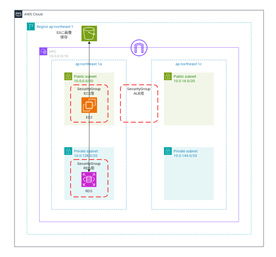
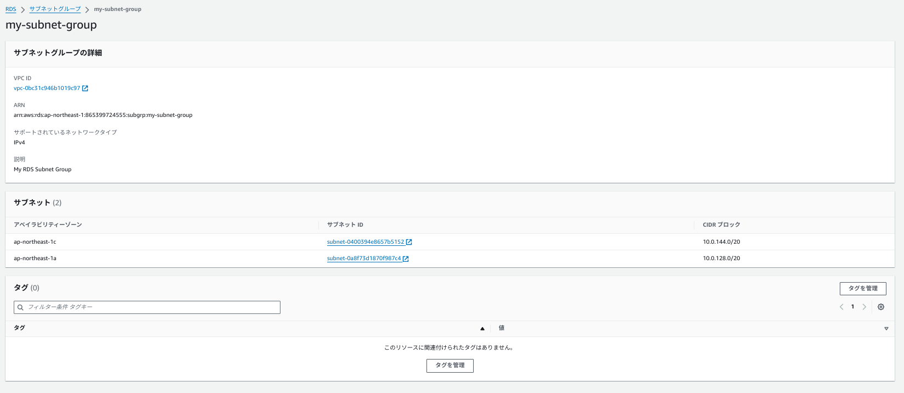
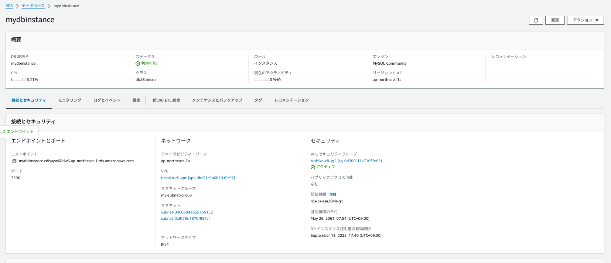
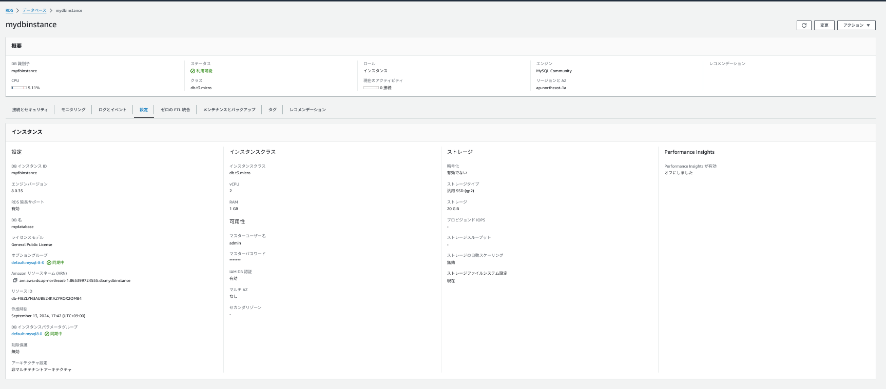
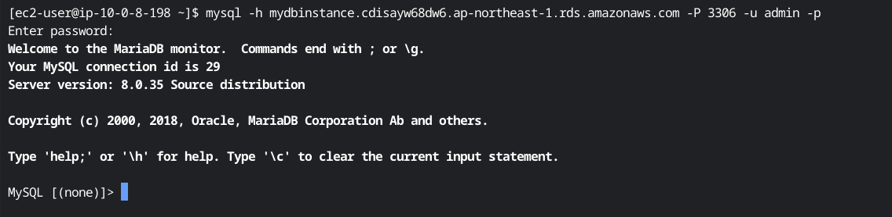
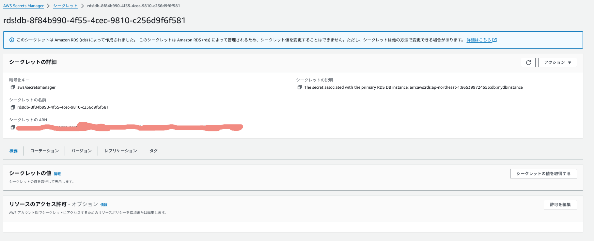
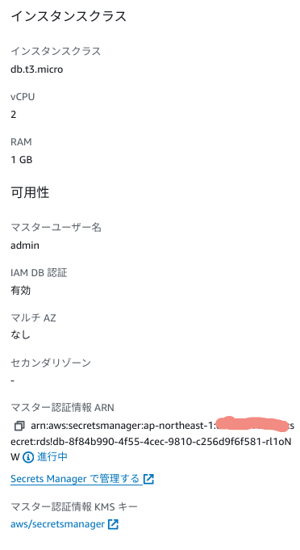
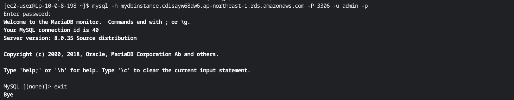

# CLIにて第5回課題環境を構築するPart.4
## RDSの作成
## 構成図


### 行うこと
1. サブネットグループ作成
2. RDS作成の変数を指定
3. RDSを作成し、接続確認


### サブネットグループ作成
今回は前回作成した"ap-northeast-1aのプライベートサブネット"と"ap-northeast-1cのプライベートサブネット"を指定。

#### 各種変数を指定する
```
SUBNET_GROUP_NAME="my-subnet-group"
```
* VPCタグ名
```
#自身が設定したvpcタグ
EC2_VPC_TAG_NAME='tushiko-cli-vpc'
```
* VPC ID
```
EC2_VPC_ID=$( \
  aws ec2 describe-vpcs \
    --filters Name=tag:Name,Values=${EC2_VPC_TAG_NAME}  \
    --query 'Vpcs[].VpcId' \
    --output text \
) \
  && echo ${EC2_VPC_ID}
#指定したVPC IDがでればOK
vpc-×××××××××××××××
```

* サブネットタグ名
ap-northeast-1aのプライベートサブネットのタグ名を指定。
ap-northeast-1cのプライベートサブネットのタグ名を指定。

```
EC2_SUBNET_TAG_NAME='tushiko-cli-private-subnet-a'
```
サブネットID

```
EC2_SUBNET_ID=$( \
  aws ec2 describe-subnets \
    --filters Name=vpc-id,Values=${EC2_VPC_ID} \
              Name=tag:Name,Values=${EC2_SUBNET_TAG_NAME} \
    --query "Subnets[].SubnetId" \
    --output text \
) \
&& echo ${EC2_SUBNET_ID}

#指定したサブネットIDが出ればOK
subnet-×××××××××××××
```

* サブネットIDの変数化 "ap-northeast-1a","ap-northeast-1c"のプライベートサブネットIDを指定
```
SUBNET_IDS="subnet-xxxxxxxx subnet-yyyyyyyy"
```

サブネットグループ作成

```
#--db-subnet-group-descriptionオプションでサブネットグループの説明
aws rds create-db-subnet-group \
    --db-subnet-group-name $SUBNET_GROUP_NAME \
    --db-subnet-group-description "My RDS Subnet Group"\
    --subnet-ids  $SUBNET_IDS          
```

以下の値が出ればOK！
```
{
    "DBSubnetGroup": {
        "DBSubnetGroupName": "サブネットグループ名",
        "DBSubnetGroupDescription": "サブネットグループの説明",
        "VpcId": "vpc-id",
        "SubnetGroupStatus": "Complete",
        "Subnets": [
            {
                "SubnetIdentifier": "subnet-id",
                "SubnetAvailabilityZone": {
                    "Name": "指定したAZ"
                },
                "SubnetOutpost": {},
                "SubnetStatus": "Active"
            },
            {
                "SubnetIdentifier": "subnet-id",
                "SubnetAvailabilityZone": {
                    "Name": "指定したAZ"
                },
                "SubnetOutpost": {},
                "SubnetStatus": "Active"
            }
        ],
        "DBSubnetGroupArn": "arn:aws:rds:ap-northeast-1:アカウント名:subgrp:サブネットグループ名",
        "SupportedNetworkTypes": [
            "IPV4"
        ]
    }
}
```
コンソール上でも確認

RDS作成の変数を指定

2. RDS作成の各種変数を設定

* ①"識別子名"
```
DB_INSTANCE_IDENTIFIER="mydbinstance"
```
* ②"データベースインスタンスクラス"
```
DB_INSTANCE_CLASS="db.t3.micro"
```
* ③"データベースエンジン"
```
DB_ENGINE="mysql"
```
* ④"ユーザ定義のDB名"
```
DB_NAME="mydatabase"
```
* ⑤"マスタユーザ名"
```
#設定したいマスタユーザ名
MASTER_USERNAME="admin"
```
* ⑥"マスタパスワード名"
```
#設定したいマスタパスワード名
MASTER_USER_PASSWORD="mypassword"
```

* ⑦セキュリティグループ
```
#自身で作成したセキュリティグループ名
EC2_SECURITY_GROUP_NAME='tushiko-cli-sg2'
```
セキュリティグループID
```
EC2_SECURITY_GROUP_ID=$( \
  aws ec2 describe-security-groups \
    --filters Name=vpc-id,Values=${EC2_VPC_ID} \
              Name=group-name,Values=${EC2_SECURITY_GROUP_NAME} \
    --query 'SecurityGroups[].GroupId' \
    --output text \
) \
&& echo ${EC2_SECURITY_GROUP_ID}

#指定されたsg-idが出るか確認
sg-XXXXXXXXXXXXXXX
```

* VPCタグ名
```
#自身が設定したvpcタグ
EC2_VPC_TAG_NAME='tushiko-cli-vpc'
```
* ⑧VPC ID
```
EC2_VPC_ID=$( \
  aws ec2 describe-vpcs \
    --filters Name=tag:Name,Values=${EC2_VPC_TAG_NAME}  \
    --query 'Vpcs[].VpcId' \
    --output text \
) \
  && echo ${EC2_VPC_ID}
#指定したVPC IDがでればOK
vpc-×××××××××××××××
```

RDSの作成のコマンド

```
aws rds create-db-instance \
    --db-instance-identifier $DB_INSTANCE_IDENTIFIER \
    --db-instance-class $DB_INSTANCE_CLASS \
    --engine $DB_ENGINE \
    --db-name $DB_NAME \
    --db-subnet-group-name $SUBNET_GROUP_NAME \
    --vpc-security-group-ids $EC2_SECURITY_GROUP_ID \
    --allocated-storage 20 \
    --enable-iam-database-authentication \
    --master-username $MASTER_USERNAME \
    --master-user-password $MASTER_USER_PASSWORD \
    --availability-zone ap-northeast-1a
```

オプションの説明

* --db-instance-identifier: インスタンス識別子。
* --db-instance-class: RDSのインスタンスクラス (例：db.t3.micro)。
* --engine: 使用するデータベースエンジン (例：mysql)。
* --db-subnet-group-name: 事前に作成したサブネットグループ名。
* --vpc-security-group-ids: VPC内のセキュリティグループID。
* --allocated-storage: データベースのストレージ
* --enable-iam-database-authentication: IAMによる認証を有効にする。
* --manage-master-user-password: 設定したマスターユーザーのパスワード名。
* --master-user-password: 設定したマスタパスワード名
* --availability-zone: 利用するAZ→今回は、"ap-northeast-1a"
  に設定

コンソールにて確認



* ec2にmysqlクライアントをインストールし、接続確認
```
#MySQLクライアントをインストール
sudo yum update
sudo yum install -y mysql
#RDSへ接続
mysql -h [エンドポイント] -P 3306 -u admin -p
```



#### その他のオプション(今回は使用しませんが状況によって使い分けてください)
```
aws rds create-db-instance \
    --storage-encrypted \
    --kms-key-id "alias/aws/rds" \
    --multi-az \
    --monitoring-role-arn arn:aws:iam::account-id:role/rds-monitoring-role \
    --enable-cloudwatch-logs-exports '["error","general","slowquery"]' /
    --deletion-protection
```

* --kms-key-id "alias/aws/rds": RDSのデフォルト暗号化キーとしてKMSのキー (デフォルト: alias/aws/rds) 下記の"--storage-encrypted"と合わせて使用
* --storage-encrypted: 暗号化を有効にするオプション
* --multi-az: マルチAZにする場合
* --monitoring-role-arn arn:aws:iam::account-id:role/rds-monitoring-role: 
下記のcloudwatchlogsを使用する場合、cloudwatchlogsにアクセスするロールを作成し、設定する
* --enable-cloudwatch-logs-exports '["error","general","slowquery"]':
RDSインスタンスが生成するデータベースログ（例: エラーログ、一般ログ、スロークエリログ）をCloudWatchLogsにエクスポートするオプション
* --deletion-protection
削除保護機能を有効にするオプション


#### 必須ではありませんが、RDS作成後に状況に応じて実施
### SecretManagerに認証情報を保存し、RDSに関連付ける

マスタユーザ名、マスタパスワードをSecretManagerに保存した認証情報を使用する
(費用を抑えたい方はマスタユーザ名・マスタパスワードを自己管理し入力してください)


1. Secrets Managerを使用したパスワードの管理を有効にする

* 作成したRDSのDBの識別子を変数化
```
DB_INSTANCE_IDENTIFIER="mydbinstance"
```
Secrets Managerを使用したパスワードの管理を有効にする
```
aws rds modify-db-instance \
    --db-instance-identifier "$DB_INSTANCE_IDENTIFIER" \
    --manage-master-user-password \
    --apply-immediately
```

--manage-master-user-password: マスターユーザーのパスワードをAWS Secrets Managerで管理するためのオプション

2. Secrets Managerで保存したシークレットの値を取得
```
aws secretsmanager get-secret-value \
  --secret-id 'Secret Manager名'
```
下記の値が出力されればOK！
```
{
    "ARN": "arn:aws:secretsmanager:リージョン:アカウントid:secret:Secret Manager名",
    "Name": "Secret Manager名",
    "VersionId": "バージョンID",
    "SecretString": "{\"username\":\"ユーザ名\",\"password\":\"パスワード{\"}",
    "VersionStages": [
        "AWSCURRENT",
        "AWSPENDING"
    ],
    "CreatedDate": "日時"
}
```

* コンソールにて、Secret Managerの作成を確認


* RDSの認証情報がSecret Managerになっているか確認


* Secret Managerで取得したパスワードで接続できるか確認


#### 次回はこちら→[ALBの作成](../cLI-command/cli-command-ALB.md)
#### 前回はこちら→[S3・EC2の作成](../cLI-command/cli-command-S3-EC2.md)

#### 参考サイト

[AWS CLI を使って RDS を作成する (自分用メモ)](https://qiita.com/propella/items/807ec930c9f6c9f6d5b8)
[](https://en-junior.com/rds_cli/#index_id6)

[AWS CLIでRDSインスタンスを作成してEC2から接続する方法](https://en-junior.com/rds_cli/#index_id6)

[CLIによる「RDS」構築](https://cloud5.jp/cli-rds/)

