# CLIにて第5回課題環境を構築するPart.3

## 構成図 
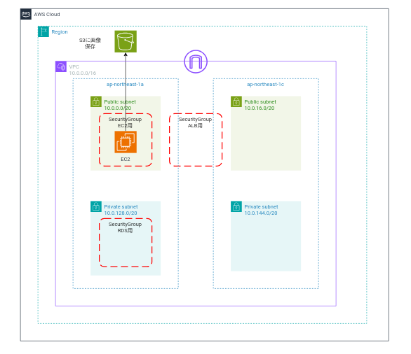

## 行うこと
1. S3バケット作成
2. IAMロール作成
3. IAMポリシー(今回はIAMロールのインラインポリシー)を作成
4. EC2にSSH接続するキーペアの作成
5. EC2をIAMロールにアタッチ
6. EC2作成
7. (オプション)ElasticIPの作成とEC2に関連付け

##
1. S3バケットを作成する
```
aws s3 mb s3://<バケット名>
```
今回は、tushiko-cliで作成。「既存名でないものを選ぶ」
```
aws s3 mb s3://tushiko-cli
```
以下が変えればOK
```
make_bucket: バケット名
```

コンソールで確認
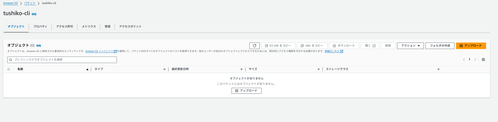

2. S3にアクセスできるようにIAMロールを作成
```
#--role-nameにて任意のrole名を指定。今回は、tushiko-cli-roleに設定
aws iam create-role \
  --role-name tushiko-cli-role \
  --assume-role-policy-document \
'{
    "Version": "2012-10-17",
    "Statement": [
        {
            "Effect": "Allow",
            "Principal": {
                "Service": "ec2.amazonaws.com"
            },
            "Action": "sts:AssumeRole"
        }
    ]
}'
```
以下が返ればOK
```
{
    "Role": {
        "Path": "/",
        "RoleName": "ロール名",
        "RoleId": "××××××××××",
        "Arn": "arn:aws:iam::ユーザID:role/ロール名",
        "CreateDate": "日時",
        "AssumeRolePolicyDocument": {
            "Version": "2012-10-17",
            "Statement": [
                {
                    "Effect": "Allow",
                    "Principal": {
                        "Service": "ec2.amazonaws.com"
                    },
                    "Action": "sts:AssumeRole"
                }
            ]
        }
    }
}
```
3. IANポリシーを作成
今回は、インラインポリシーで作成

* --role-nameにて作成したrole名を指定。今回は、"tushiko-cli-role"に設定
* --role-nameにて任意のrole名を指定。今回は、"tushiko-cli-policy"に設定
```
aws iam put-role-policy \
  --role-name tushiko-cli-role \
  --policy-name tushiko-cli-policy \
  --policy-document '{ "Version": "2012-10-17", "Statement": [ { "Action": [ "s3:GetObject", "s3:PutObject", "s3:ListBucket", "s3:DeleteObject", "s3:GetBucketLocation" ], "Resource": "arn:aws:s3:::*", "Effect": "Allow" }, { "Action": "*", "Resource": [ "arn:aws:s3:::tushiko-cli", "arn:aws:s3:::tushiko-cli/*" ], "Effect": "Allow" } ] }'
```

コンソール上でIAMロール・IAMポリシーの作成を確認。IAMポリシーがIAMロールにアタッチされているか確認。

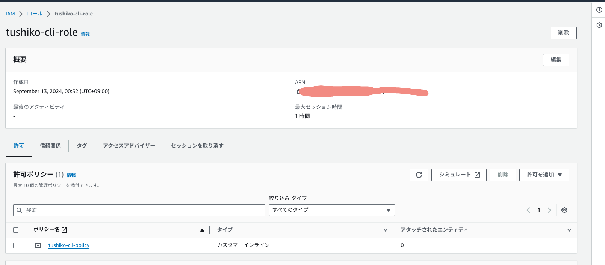
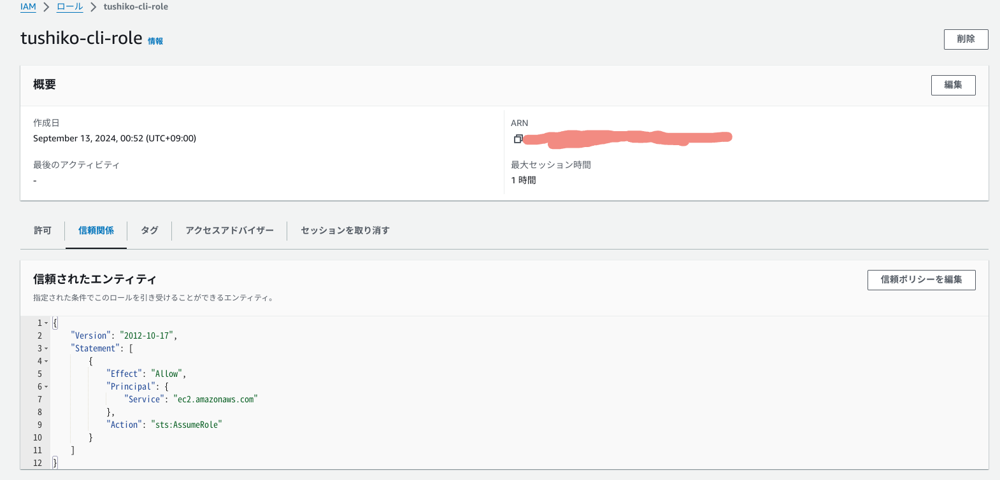
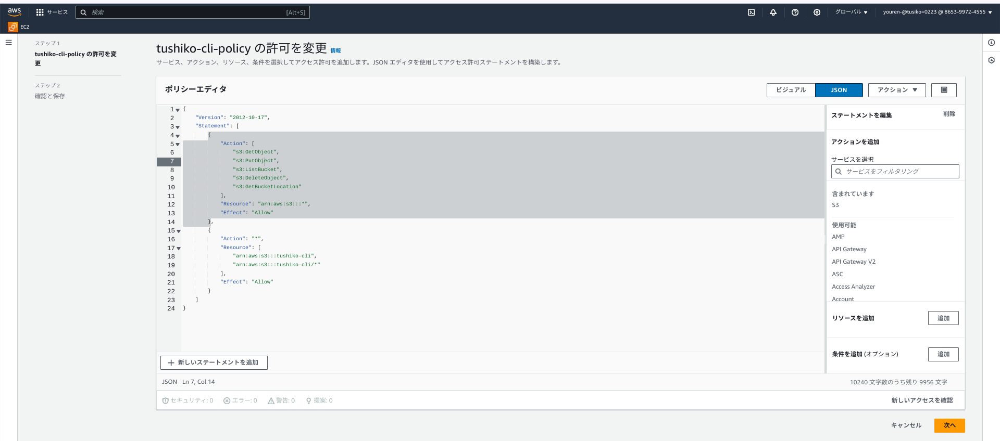

4. EC2作成
EC2にアクセスするためのキーペアを作成


* aws ec2 create-key-pair --key-name "キーペア名" --query 'KeyMaterial' --output text > "キーペア名".pem

* aws ec2 create-key-pair --key-name TushikocliKeyPair --query 'KeyMaterial' --output text > TushikocliKeyPair.pem
* 作業ディレクトリにpemファイルがダウンロードされていれば成功
    * pemファイルに読み込み権限を与える
```
chmod 400 TushikocliKeyPair.pem
```
自分のディレクトリにあるか確認

コンソールでも作成確認
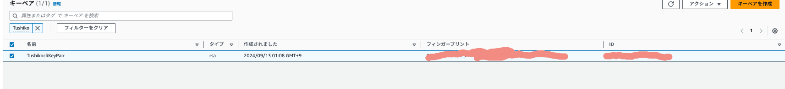

5. EC2インスタンスの起動
AZ:ap-northeast-1aのパブリックサブネットにインターネットからの接続確認に使うためのEC2を作成。

* ①リージョンを環境変数に指定
VPCを作成するリージョンを環境変数に指定。この手順では東京リージョンを指定。
```
export AWS_DEFAULT_REGION='ap-northeast-1'
```
* ②各種変数の指定

* EC2インスタンスタグ名
    * 自身が設定したいEC2インスタンスタグ名
    * ここでは"tushiko-cli-ec2-httpserver"に設定。
```
EC2_INSTANCE_TAG_NAME='tushiko-cli-ec2-httpserver'
```
* EC2インスタンスタグ文字列
    * 自身が設定したい"Key名”、”タグ名”を設定
```
STRING_TAG_CONF_INSTANCE="ResourceType=instance,Tags=[{Key=Name,Value=${EC2_INSTANCE_TAG_NAME}}]" \
  && echo ${STRING_TAG_CONF_INSTANCE}
```
以下の表示でKeyとValueを確認
```
ResourceType=instance,Tags=[{Key=Name,Value=tushiko-cli-ec2-httpserver}]
```

* イメージID

ここでは最新のAmazon Linux 2のイメージIDを取得。
```
EC2_INSTANCE_IMAGE_ID=$( \
  aws ec2 describe-images \
    --owners amazon \
    --filters Name=name,Values=amzn2-ami-hvm-2.0.*-x86_64-gp2 \
              Name=state,Values=available \
    --query 'reverse(sort_by(Images, &CreationDate))[:1].ImageId' \
    --output text \
) \
&& echo ${EC2_INSTANCE_IMAGE_ID}
```
ami-idを習得できればOK
```
ami-XXXXXXXXXXXXXXX
```
* インスタンスタイプ
    * 自身が設定したいインスタンスタイプ
    * 無料枠を使い切ったためt2.microよりスペックが高く安価な"t3.micro"を使用
```
EC2_INSTANCE_TYPE="t3.micro"
```
* VPCタグ名
    * 自身が設定したvpcタグ
```
EC2_VPC_TAG_NAME='tushiko-cli-vpc'
```
* VPC ID
```
EC2_VPC_ID=$( \
  aws ec2 describe-vpcs \
    --filters Name=tag:Name,Values=${EC2_VPC_TAG_NAME}  \
    --query 'Vpcs[].VpcId' \
    --output text \
) \
  && echo ${EC2_VPC_ID}
```
指定したVPC IDがでればOK
```
vpc-×××××××××××××××
```
* サブネットタグ名
ap-northeast-1aのパブリックサブネットのタグ名を指定。
```
EC2_SUBNET_TAG_NAME='tushiko-cli-public-subnet-a'
```
サブネットID
```
EC2_SUBNET_ID=$( \
  aws ec2 describe-subnets \
    --filters Name=vpc-id,Values=${EC2_VPC_ID} \
              Name=tag:Name,Values=${EC2_SUBNET_TAG_NAME} \
    --query "Subnets[].SubnetId" \
    --output text \
) \
&& echo ${EC2_SUBNET_ID}

#指定したサブネットIDが出ればOK
subnet-×××××××××××××
```
* セキュリティグループ
```
EC2_SECURITY_GROUP_NAME='tushiko-cli-sg1'
```
セキュリティグループID
```
EC2_SECURITY_GROUP_ID=$( \
  aws ec2 describe-security-groups \
    --filters Name=vpc-id,Values=${EC2_VPC_ID} \
              Name=group-name,Values=${EC2_SECURITY_GROUP_NAME} \
    --query 'SecurityGroups[].GroupId' \
    --output text \
) \
&& echo ${EC2_SECURITY_GROUP_ID}
```
指定されたsg-idが出るか確認
```
sg-XXXXXXXXXXXXXXX
```

* キーペア
```
EC2_KEY_PAIR_NAME='TushikocliKeyPair'
```

5. IAMロールを作成したインスタンスEC2に割り当てる
* IAMロールを変数指定
```
IAM_ROLE_NAME="tushiko-cli-role"
```

* IAMロールが含まれるインスタンスプロファイルを作成
```
aws iam create-instance-profile --instance-profile-name $IAM_ROLE_NAME-instance-profile
```
以下の値が返ればOK
```
{
    "InstanceProfile": {
        "Path": "/",
        "InstanceProfileName": "インスタンスプロファイル名",
        "InstanceProfileId": "××××××××××××",
        "Arn":"arn:aws:iam::アカウントID:instance-profile/インスタンスプロファイル名",
        "CreateDate": "日時",
        "Roles": []
    }
}
```
* IAMロールをインスタンスプロファイルにアタッチする
```
aws iam add-role-to-instance-profile \
    --instance-profile-name $IAM_ROLE_NAME-instance-profile \
    --role-name $IAM_ROLE_NAME
```
* --iam-instance-profileオプションでIAMロールをアタッチ

コンソールでも確認

！[](../images/s3-ec2/profile-1.png)

6. EC2インスタンス起動
以下のコマンドを実行してEC2インスタンスを起動する。

* "--associate-public-ip-address"オプションでパブリックIPアドレスを割り当てる
```
aws ec2 run-instances \
  --image-id ${EC2_INSTANCE_IMAGE_ID} \
  --instance-type ${EC2_INSTANCE_TYPE} \
  --subnet-id ${EC2_SUBNET_ID} \
  --security-group-ids ${EC2_SECURITY_GROUP_ID} \
  --tag-specifications ${STRING_TAG_CONF_INSTANCE} \
  --key-name ${EC2_KEY_PAIR_NAME} \
  --iam-instance-profile Name=$IAM_ROLE_NAME-instance-profile \
  --associate-public-ip-address
```


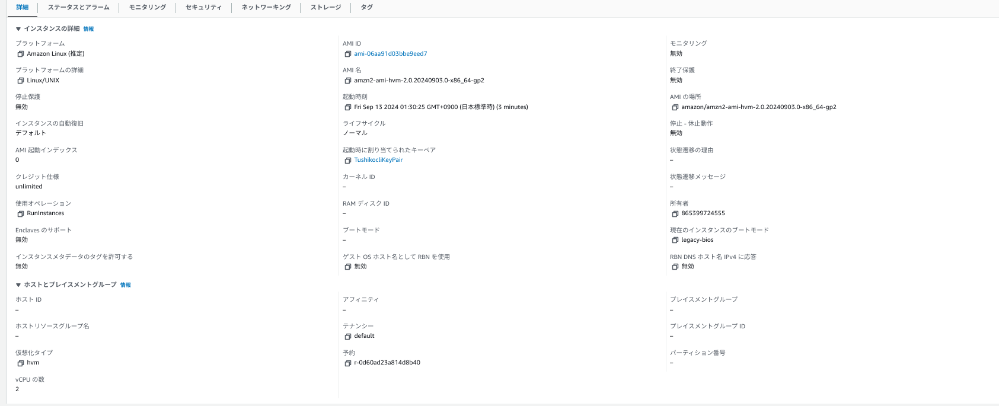

サブネットのパブリックIPアドレス自動割り当て設定を有効になっていなかったため"パブリック IPv4 DNS”が付与されない場合。

1. サブネットのパブリックIPアドレス自動割り当て設定を有効にする

* サブネットIDを変数化
```
SUBNET_ID=”設定されたサブネットID"
```
* "--map-public-ip-on-launchコマンド"で自動化を有効化
```
aws ec2 modify-subnet-attribute \
    --subnet-id $SUBNET_ID \
    --map-public-ip-on-launch
```

2. パブリック IPv4 DNSがつかないのは、VPC内のDNSホスト名が有効になっていなかったため

* DNSホスト名が有効になるように修正
* DNSホストを有効化
```
aws ec2 modify-vpc-attribute \
  --vpc-id <vpc-id> \
  --enable-dns-hostnames
```

SSH接続して動作確認。
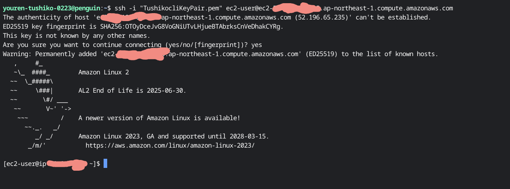

7. オプションElasitcIPを取得し、作成したEC2インスタンスに割り当てる

* ElasticIPを作成

* 作成したElasticIPのAllocation IDを変数にて保存して作成
```
ALLOC_ID=$(aws ec2 allocate-address --domain vpc --query 'AllocationId' --output text)
```
ElasticIPはデフォルトで5個に設定されているため、制限を超えるとエラーが出る。
```
ALLOC_ID=$(aws ec2 allocate-address --domain vpc --query 'AllocationId' --output text)

An error occurred (AddressLimitExceeded) when calling the AllocateAddress operation: The maximum number of addresses has been reached.
```

* ElasticIPを開放して、5個いかにするか、使用数上限を引き上げてもらう

Elastic IPのAllocation IDとは

Elastic IP (EIP) がAWSリソースに割り当てられる際にAWSが付与する一意の識別子。Elastic IPを管理する際に使用したり、EC2にアタッチしたりするときに使用する。

コンソールにて確認
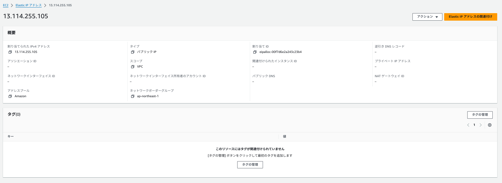

* 直前で作成されたインスタンスのidを取得するコマンドでインスタンスの確認をする

* --query: JSON形式の出力から特定の情報を抜き出すために使用。
* --output text: 出力をテキスト形式で表示し、インスタンスIDのみ取得。

* 直近に作成したインスタンスのIDを取得する
直近に作成したインスタンスのIDを取得したい場合は、launch-time に基づいてソートし、最新のインスタンスIDを取得する。

```
aws ec2 describe-instances \
  --query 'Reservations[*].Instances[*].[InstanceId, LaunchTime]' \
  --output text | sort -k2 | tail -n 1 | awk '{print $1}'
```

2. 関連するINSTANCE_IDを変数化する

* INSTANCE_ID_NAME= <作成したインスタンスID>
```
INSTANCE_ID_NAME= i-×××××××××××××
```

1. ElasticIPをインスタンスに関連付ける

```
aws ec2 associate-address \
  --instance-id $INSTANCE_ID_NAME \
  --allocation-id $ALLOC_ID
```
以下の値がでればOK！
```
{
    "AssociationId": "eipassoc-×××××××××××××"
}
```
インスタンスに関連付けられたか確認
```
echo "Elastic IP $ALLOC_ID assigned to Instance $INSTANCE_ID"
```
以下の値がでればOK
```
Elastic IP eipalloc-××××××××××××××× assigned to Instance 
```

コンソール上でも確認
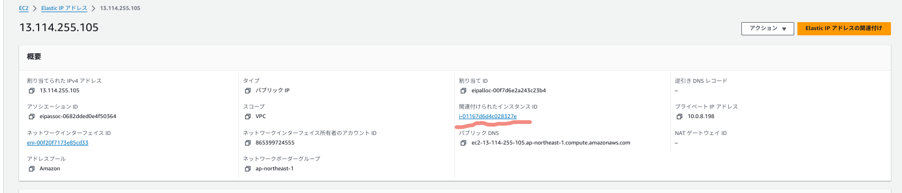

#### ElasicIPをインスタンスからデタッチし、開放する

1. ElasicIPをインスタンスからデタッチする
* Elastic IPのAssocation IDを取得
```
aws ec2 describe-addresses \
  --allocation-ids $ALLOC_ID
``` 
* ElasicIPをインスタンスからデタッチ

```
aws ec2 disassociate-address \
  --association-id <association_id>
```
コンソールで確認 


* ElasticIPの開放
```
aws ec2 release-address \
  --allocation-id $ALLOC_ID
```

コンソールにて確認
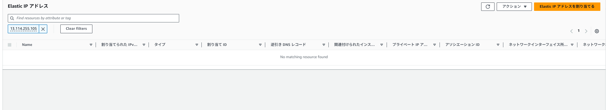

#### 次回はこちら→[RDSの作成](../cLI-command/cli-command-RDS.md)
#### 前回はこちら→[SGを作成](../cLI-command/cli-command-SG.md)

#### 参考サイト
[Amazon VPCをAWS CLIで構築する手順⑤](https://zenn.dev/amarelo_n24/articles/0703c4807dde4d)

[開発環境のEC2にIAM Roleをアタッチし、AWS CLIを使用できる様にする](https://zenn.dev/hikary/articles/f62464a2501727)

[AWS CLI で IAM ロールを作成する](https://zenn.dev/y_u_t_a/articles/58257348c3754d)

[【入門】AWS CLIでEC2インスタンスを立ち上げてみた！](https://www.isoroot.jp/blog/3188/)

[#2 AWS CLIでEC2を作成する](https://qiita.com/kokichi8/items/20d52fb266677f0e88f3)