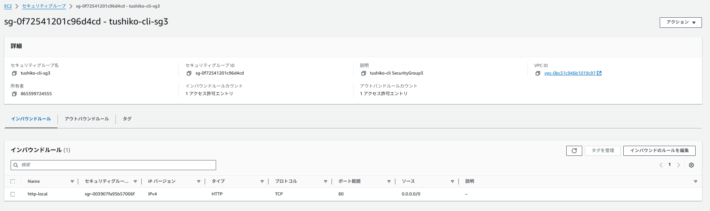

# CLIにて第5回課題環境を構築するPart.2

## 構成図


### セキュリティグループを作成 (EC2用、RDS用、ALB用)
* アウトバウンド"すべてのトラフィック"と"0.0.0.0/0"は自動生成のため省略

|構築するセキュリティグループの名称|用途|
| ---- | ---- | 
|tushiko-cli-sg1|EC2 |
|tushiko-cli-sg2|RDS|
|tushiko-cli-sg3|ALB |

#### EC2のセキュリティグループ
インバウンド
|タイプ|プロトコル|ポート範囲|ソース|
| ---- | ---- | ---- | ---- |
|HTTP|TCP|80|0.0.0.0/0|
|SSH|TCP|22|マイIPアドレス|

アウトバウンド
|タイプ|プロトコル|ポート範囲|ソース|
| ---- | ---- | ---- | ---- |
|すべてのトラフィック|すべて|すべて|0.0.0.0/0|

#### RDSのセキュリティグループ
インバウンド
|タイプ|プロトコル|ポート範囲|ソース|
| ---- | ---- | ---- | ---- |
|MYSQL/Aurora|TCP|3306|EC2のセキュリティグループ|

アウトバウンド
|タイプ|プロトコル|ポート範囲|ソース|
| ---- | ---- | ---- | ---- |
|すべてのトラフィック|すべて|すべて|0.0.0.0/0|

#### ALBのセキュリティグループ
インバウンド
|タイプ|プロトコル|ポート範囲|ソース|
| ---- | ---- | ---- | ---- |
|HTTP|TCP|80|0.0.0.0/0|

アウトバウンド
|タイプ|プロトコル|ポート範囲|ソース|
| ---- | ---- | ---- | ---- |
|すべてのトラフィック|すべて|すべて|0.0.0.0/0|

## セキュリティグループを作成

1. リージョンを環境変数に指定
VPCを作成するリージョンを環境変数に指定します。この手順では東京リージョンを指定。
```
export AWS_DEFAULT_REGION='ap-northeast-1'
```
2. 各種変数の指定

* ①VPCタグ名を設定。
* 自身で設定するVPCを設定
```
EC2_VPC_TAG_NAME='tushiko-cli-vpc'
```
* ②セキュリティグループ名を設定
* 自身で設定する"sg"を設定
```
EC2_SECURITY_GROUP_NAME='tushiko-cli-sg1'
```

* ③セキュリティグループの説明を設定
* 自身で判別のため任意の説明を設定
```
EC2_SECURITY_GROUP_DESCRIPTION='tushiko-cli SecurityGroup1'
```
* ④VPC IDを設定
```
EC2_VPC_ID=$( \
  aws ec2 describe-vpcs \
   --filters Name=tag:Name,Values=${EC2_VPC_TAG_NAME}  \
   --query 'Vpcs[].VpcId' \
   --output text \
) \
&& echo ${EC2_VPC_ID}
```
以下の値が返ってくればOK!
```
vpc-XXXXXXXXXXXXXXXXX
```

3. セキュリティグループ作成
以下のコマンドを実行して、セキュリティグループを作成。
```
aws ec2 create-security-group \
--group-name ${EC2_SECURITY_GROUP_NAME} \
--description "${EC2_SECURITY_GROUP_DESCRIPTION}" \
--vpc-id ${EC2_VPC_ID}
```

成功したら以下のように表示。
```
{
    "GroupId": "sg-XXXXXXXXXXXXXXXXX"
}
```

4. 作成確認

以下のコマンドを実行して、セキュリティグループが正しく作成されたことを確認。

指定のセキュリティグループ名とVPC IDで抽出したJSONから、セキュリティグループのグループ名をテキスト形式で表示させる。
```
aws ec2 describe-security-groups \
  --filters Name=vpc-id,Values=${EC2_VPC_ID} \
            Name=group-name,Values=${EC2_SECURITY_GROUP_NAME} \
  --query 'SecurityGroups[].GroupName' \
  --output text
```

コンソールにて確認


## 作成したセキュリティグループにルールを追加する
今回は、EC2用の"sg-tushiko-cli-sg1"に下記のルールを追加。

インバウンド
|タイプ|プロトコル|ポート範囲|ソース|
| ---- | ---- | ---- | ---- |
|HTTP|TCP|80|0.0.0.0/0|
|SSH|TCP|22|マイIPアドレス|

#### HTTP:80番ポート  0.0.0.0/0を追加

1. リージョンを環境変数に指定

VPCを作成するリージョンを環境変数に。ここでは、東京リージョンを指定。

```
export AWS_DEFAULT_REGION='ap-northeast-1'
```

2. 各種変数の指定

* ①VPCタグ名を設定
```
EC2_VPC_TAG_NAME='tushiko-cli-vpc'
```
* ②セキュリティグループ名を設定
```
EC2_SECURITY_GROUP_NAME='tushiko-cli-sg1'
```
* ③ルールのタグ名を設定
```
EC2_SECURITY_GROUP_RULE_TAG_NAME='http-local'
```
* ➃セキュリティグループタグ文字列を設定
```
STRING_EC2_EC2_SECURITY_GROUP_RULE_TAG="ResourceType=security-group-rule,Tags=[{Key=Name,Value=${EC2_SECURITY_GROUP_RULE_TAG_NAME}}]" \
  && echo ${STRING_EC2_EC2_SECURITY_GROUP_RULE_TAG}
```

* ⑤プロトコルの設定
```
EC2_SECURITY_GROUP_RULE_PROTOCOL='tcp'
```

* ⑥ポート番号の設定
```
EC2_SECURITY_GROUP_RULE_PORT='80'
```

* ⑦配置する"VPC ID"の設定
```
EC2_VPC_ID=$( \
  aws ec2 describe-vpcs \
   --filters Name=tag:Name,Values=${EC2_VPC_TAG_NAME}  \
   --query 'Vpcs[].VpcId' \
   --output text \
) \
&& echo ${EC2_VPC_ID}
```

以下の値が出ればOK!
```
vpc-XXXXXXXXXXXXXXXXX
```

* ⑧セキュリティグループIDを設定
```
EC2_SECURITY_GROUP_ID=$( \
  aws ec2 describe-security-groups \
    --filters Name=vpc-id,Values=${EC2_VPC_ID} \
      Name=group-name,Values=${EC2_SECURITY_GROUP_NAME} \
    --query "SecurityGroups[].GroupId" \
    --output text \
) \
&& echo ${EC2_SECURITY_GROUP_ID}
``` 

* 追加したいsg-idが出ることを確認
```
sg-0xxxxxxxxxXXXXXXX
```
* ⑨CIDRブロックを設定
```
EC2_SECURITY_GROUP_RULE_CIDR="0.0.0.0/0"
echo ${EC2_SECURITY_GROUP_RULE_CIDR}
```

3. ルール追加

以下のコマンドを実行します。
```
aws ec2 authorize-security-group-ingress \
  --group-id ${EC2_SECURITY_GROUP_ID} \
  --protocol ${EC2_SECURITY_GROUP_RULE_PROTOCOL} \
  --port ${EC2_SECURITY_GROUP_RULE_PORT} \
  --cidr ${EC2_SECURITY_GROUP_RULE_CIDR} \
  --tag-specifications ${STRING_EC2_EC2_SECURITY_GROUP_RULE_TAG}
```

成功すると以下のように表示。
```
{
    "Return": true,
    "SecurityGroupRules": [
        {
            "SecurityGroupRuleId": "sg-0xxxxxxxxxXXXXXXX",
            "GroupId": "sg-XXXXXXxXXXXXXXXXX",
            "GroupOwnerId": "XXXXXXXXXXXX",
            "IsEgress": false,
            "IpProtocol": "tcp",
            "FromPort": 80,
            "ToPort": 80,
            "CidrIpv4": "0.0.0.0/0",
            "Tags": [
                {
                    "Key": "Name",
                    "Value": "http-local"
                }
            ]
        }
    ]
}
```

* 間違えてルールを追加したり、不要なルールを削除したい場合は、以下のコマンドを実行する。

* インバウンドのsgを削除
```
aws ec2 revoke-security-group-ingress \
  --group-id ${EC2_SECURITY_GROUP_ID} \
  --protocol ${EC2_SECURITY_GROUP_RULE_PROTOCOL} \
  --port ${EC2_SECURITY_GROUP_RULE_PORT} \
  --cidr ${EC2_SECURITY_GROUP_RULE_CIDR}
```
* 作成時に使用した --tag-specifications オプションはサポートしていないため、コメントアウトして使用する。

さらに、"tushiko-cli-sg1"にインバウンドルール"22番ポート""マイIPルール"を追加する

* ①・②は上記と同じ。
* ③ルールのタグ名を設定
* httpからsshに変更
```
EC2_SECURITY_GROUP_RULE_TAG_NAME='ssh-local'
```
* ④・⑤は上記と同じ
* ⑥ポート番号の設定
```
#80番から22番に変更
EC2_SECURITY_GROUP_RULE_PORT='22'
```

* ⑦・⑧は上記と同じ
* ⑨許可ソースを"マイIP"にする
```
EC2_SECURITY_GROUP_RULE_CIDR=$( curl -s http://checkip.amazonaws.com/ )/32 \
&& echo ${EC2_SECURITY_GROUP_RULE_CIDR}
```
* 出力値がマイIPになっているか確認
```
×××.×××.×××.×××/32
```

上記の通り、3. ルール追加を再度実施
```
aws ec2 authorize-security-group-ingress \
  --group-id ${EC2_SECURITY_GROUP_ID} \
  --protocol ${EC2_SECURITY_GROUP_RULE_PROTOCOL} \
  --port ${EC2_SECURITY_GROUP_RULE_PORT} \
  --cidr ${EC2_SECURITY_GROUP_RULE_CIDR} \
  --tag-specifications ${STRING_EC2_EC2_SECURITY_GROUP_RULE_TAG}
```

コンソールにて確認


### セキュリティグループRDS用に"tushiko-cli-sg2"、ALB用に"tushiko-cli-sg3"を作成する

#### RDSのセキュリティグループ
インバウンド
|タイプ|プロトコル|ポート範囲|ソース|
| ---- | ---- | ---- | ---- |
|MYSQL/Aurora|TCP|3306|EC2のセキュリティグループ|

1. リージョンを環境変数に指定
VPCを作成するリージョンを環境変数に指定。この手順では東京リージョンを指定。
```
export AWS_DEFAULT_REGION='ap-northeast-1'
```

2. 各種変数の指定

* ①VPCタグ名
```
EC2_VPC_TAG_NAME='tushiko-cli-vpc'
```
* ②セキュリティグループ名
```
EC2_SECURITY_GROUP_NAME='tushiko-cli-sg2'
```
* ③ルールのタグ名
```
EC2_SECURITY_GROUP_RULE_TAG_NAME='MYSQL/Aurora-local'
```
* ④セキュリティグループタグ文字列
```
STRING_EC2_EC2_SECURITY_GROUP_RULE_TAG="ResourceType=security-group-rule,Tags=[{Key=Name,Value=${EC2_SECURITY_GROUP_RULE_TAG_NAME}}]" \
  && echo ${STRING_EC2_EC2_SECURITY_GROUP_RULE_TAG}
```

* ⑤プロトコル
```
EC2_SECURITY_GROUP_RULE_PROTOCOL='tcp'
```
* ⑥ポート番号
```
EC2_SECURITY_GROUP_RULE_PORT='3306'
```
* ⑦VPC ID
```
EC2_VPC_ID=$( \
  aws ec2 describe-vpcs \
   --filters Name=tag:Name,Values=${EC2_VPC_TAG_NAME}  \
   --query 'Vpcs[].VpcId' \
   --output text \
) \
&& echo ${EC2_VPC_ID}
```
設定したい"vpc-id"と一致するか確認
```
vpc-XXXXXXXXXXXXXXXXX
```

* ⑧セキュリティグループID
```
EC2_SECURITY_GROUP_ID=$( \
  aws ec2 describe-security-groups \
    --filters Name=vpc-id,Values=${EC2_VPC_ID} \
      Name=group-name,Values=${EC2_SECURITY_GROUP_NAME} \
    --query "SecurityGroups[].GroupId" \
    --output text \
) \
&& echo ${EC2_SECURITY_GROUP_ID}
```
設定したいsgのidが一致しているか確認
```
sg-0xxxxxxxxxXXXXXXX
```
* ⑨許可ソースをEC2のsgを許可するように変数を設定する。

    * セキュリティグループのID（3306ポートを許可するEC2用に作成したセキュリティグループID）
```
EC2_SOURCE_SECURITY_GROUP_ID='sg-xxxxxxxx'
```

3. 以下のコマンドを実行

* 5行目”--cidr ${EC2_SECURITY_GROUP_RULE_CIDR}"を
"--source-group ${EC2_SOURCE_SECURITY_GROUP_ID}"に変更
```
aws ec2 authorize-security-group-ingress \
  --group-id ${EC2_SECURITY_GROUP_ID} \
  --protocol ${EC2_SECURITY_GROUP_RULE_PROTOCOL} \
  --port ${EC2_SECURITY_GROUP_RULE_PORT} \
  --source-group ${EC2_SOURCE_SECURITY_GROUP_ID} \
  --tag-specifications ${STRING_EC2_EC2_SECURITY_GROUP_RULE_TAG}
```

セキュリティグループが設定されているかを確認

コンソール上でも確認。


ALBのセキュリティグループに関しては上記の工程を繰り返し実施することで作成。
* セキュリティグループ名"tushiko-cli-sg3”で作成

コンソール上でも確認。



#### 次回はこちら→[S3・EC2を作成](../cLI-command/cli-command-S3-EC2.md)

#### 過去の記事→[CLIでVPCを作成](../cLI-command/cli-command-network.md)

#### 参考サイト
[Amazon VPCをAWS CLIで構築する手順②](https://zenn.dev/amarelo_n24/articles/30cb58cad805e8)
