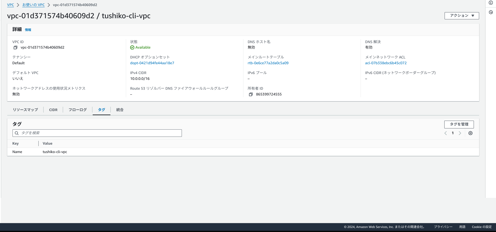
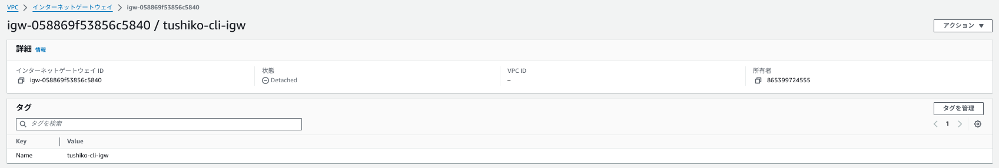
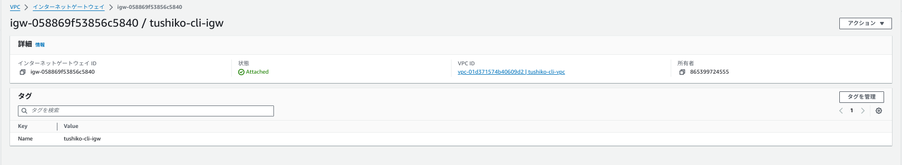
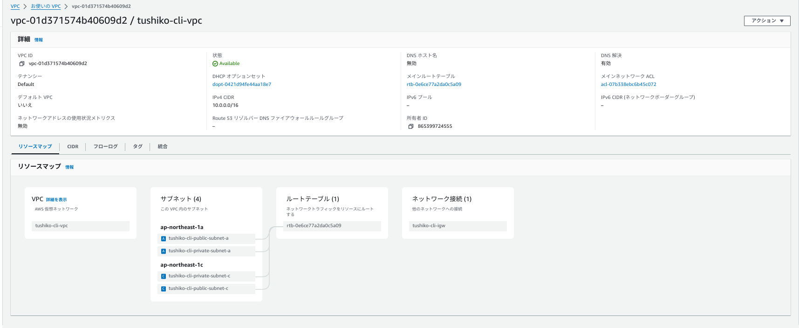
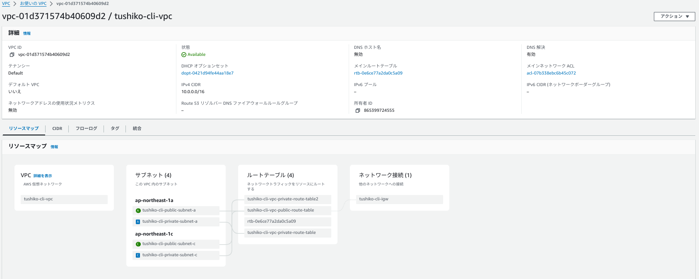
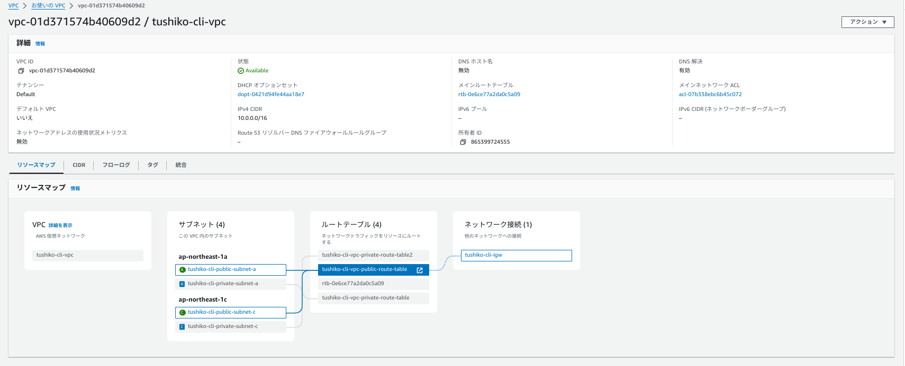
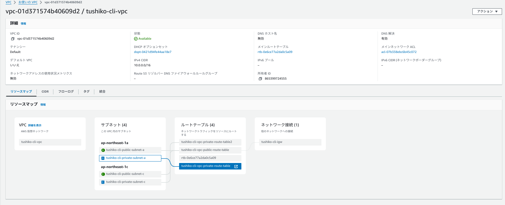
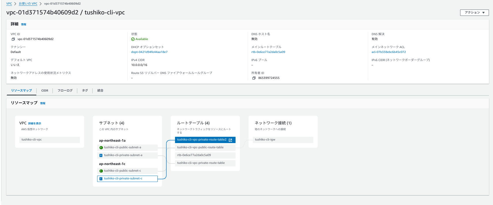
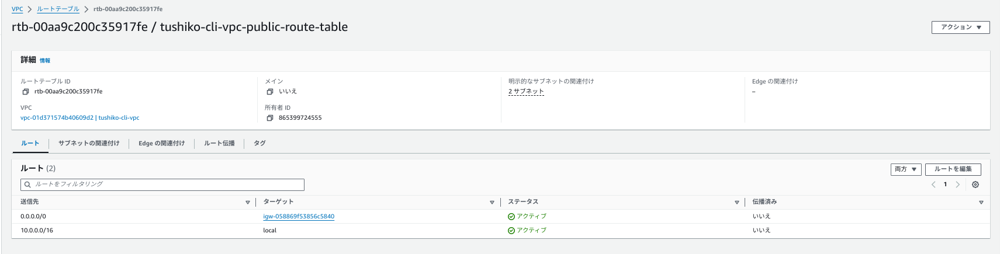

# CLIにて第5回課題環境を構築するPart.1

## 構成図

## 行うこと
1. VPCを作成。
2. IGWを作成し、VPCにアタッチ。
3. サブネット(Publicを2つ、Privateを2つ)を作成。
4. ルートテーブル(Public用に1つ、Private用に2つ)を作成。
5. 4で作成したルートテーブルに3で作成したサブネットを関連付け

## VPCの作成
1. リージョンを環境変数に指定する
2. 各種変数<VPCタグ>と<CIDRブロック>を指定する
3. 作成コマンド実行
4. 作成確認

### 1.リージョンを環境変数に指定する

* VPCを作成するリージョンを環境変数に指定する。ここでは東京リージョン"ap-northeast-1"を指定
```
export AWS_DEFAULT_REGION='ap-northeast-1'
```

### 2.各種変数<VPCタグ>と<CIDRブロック>を指定する
* VPCタグ名(自身が設定したいVPC名)を設定。ここでは、"tushiko-cli-vpc"を設定。
```
#VPCタグ
EC2_VPC_TAG_NAME='tushiko-cli-vpc'
```
* CIDRブロック(自身が設定したいCIDRブロック)を設定。ここでは、"10.0.0.0/16"を設定。
```
#CIDRブロック
EC2_VPC_CIDR='10.0.0.0/16'
```

VPCタグ文字列(自身が設定したいタグをKeyとValueにて設定)ここでは、Key=Name、Value＝EC2_VPC_TAG_NAME(tushiko-cli-vpc)を設定。
```
#タグを設定
#ここでは環境変数で記載し自身で設定したタグを確認するためechoコマンドにて出力しています
STRING_EC2_VPC_TAG="ResourceType=vpc,Tags=[{Key=Name,Value=${EC2_VPC_TAG_NAME}}]" \
&& echo ${STRING_EC2_VPC_TAG}
#こちらも可
STRING_EC2_VPC_TAG="ResourceType=vpc,Tags=[{Key=<自身が設定したいKey名>,Value=$＜{自身が設定したいValue名>}]" \
&& echo ${STRING_EC2_VPC_TAG}
```
これが出力されればOK
```
#今回は、Key=Name,Value=tushiko-cli-vpcとして設定
ResourceType=vpc,Tags=[{Key=Name,Value=tushiko-cli-vpc}]
```

### 3.作成コマンド実行
```
aws ec2 create-vpc \
  --cidr-block ${EC2_VPC_CIDR} \
  --tag-specifications ${STRING_EC2_VPC_TAG}
```
正常に生成された場合は以下が出力される
```
{
    "Vpc": {
        "CidrBlock": "10.0.0.0/16",
        "DhcpOptionsId": "dopt-xxxxxxxxxxxxxxxxx",
        "State": "pending",
        "VpcId": "vpc-xxxxxxxxxxxxxxxxxx",
        "OwnerId": "XXXXXXXXXXXXX",
        "InstanceTenancy": "default",
        "Ipv6CidrBlockAssociationSet": [],
        "CidrBlockAssociationSet": [
            {
            "AssociationId""vpc-cidr-assoc-xxxxxxxxxxxxxxxxx",
                "CidrBlock": "10.0.0.0/16",
                "CidrBlockState": {
                    "State": "associated"
                }
            }
        ],
        "IsDefault": false,
        "Tags": [
            {
                "Key": "<自身が設定したKey名>",
                "Value": "＜自身が設定したVPCタグ名＞"
            }
        ]
    }
}
```

### 4.VPCの作成確認

指定したVPCタグ名(自身が設定したVPC名)でVPCが作られていることを確認。
```
aws ec2 describe-vpcs \
  --filters Name=tag:Name,Values=${EC2_VPC_TAG_NAME}  \
  --query 'Vpcs[].Tags[?Key == `Name`].Value' \
  --output text
```

#### --filters 
* 役割: 特定の条件に基づいてリソース（この場合はVPC）を絞り込むためのフィルタを指定する。
* 今回は、Name=tag:Name,Values=${EC2_VPC_TAG_NAME} というフィルタが設定されていて、タグのキーが「Name」で、タグの値が ${EC2_VPC_TAG_NAME} という値に一致するVPCを探すために使用している。
1. Name=tag:Name: VPCに付与された「Name」タグを対象にフィルタをかける。
2. Values=${EC2_VPC_TAG_NAME}: そのタグの値が ${EC2_VPC_TAG_NAME} 変数の値に一致するものを探す。

#### --query
* 役割: 出力結果を加工・絞り込むためのオプションで、JMESPathクエリを使って特定のデータだけを取得する。
* この場合: 'Vpcs[].Tags[?Key == Name].Value' というクエリが使われている。コマンドの動きは下記参照。
1. Vpcs[]: 複数のVPCリストからデータを取得する
2. Tags[?Key == 'Name']: 各VPCのタグの中から、キーが「Name」のタグを見つける。
3. .Value: その「Name」タグの値を取得する。

--output text
* 役割: クエリで指定した取得結果をtextで出力する。この場合、"「Name」タグの値"に一致する値を取得する。

「VPCタグ」通りの値が表示されればOK
```
#今回は"tushiko-cli-vpc"が表示されればOK
<VPCタグ名>
```

コンソール上でも作成確認


## IGWの作成

## 行うこと
1. リージョンを環境変数に指定する
2. 各種変数インターネットゲートウェイの<タグ名>と<タグ文字列>を指定する
3. 作成コマンド実行
4. インターネットゲートウェイの作成確認
5. 作成したインターネットゲートウェイをVPCにアタッチ

### 1.リージョンを環境変数に指定する

* インターネットゲートウェイを作成するリージョンを環境変数に指定する。ここでは東京リージョン"ap-northeast-1"を指定
```
export AWS_DEFAULT_REGION='ap-northeast-1'
```

### 2.各種変数インターネットゲートウェイの<タグ名>と<タグ文字列>を指定する
* インターネットタグ名(自身が設定したいインターネットゲートウェイ名)を設定。ここでは、"tushiko-cli-igw"を設定。
```
EC2_INTERNET_GATEWAY_TAG_NAME='tushiko-cli-igw'
```
インターネットゲートウェイタグ文字列(自身が設定したいタグをKeyとValueにて設定)を設定。ここでは、Key=Name,Value=

```
#タグを設定
#ここでは環境変数で記載し自身で設定したタグを確認するためechoコマンドにて出力しています

STRING_EC2_INTERNET_GATEWAY_TAG="ResourceType=internet-gateway,Tags=[{Key=Name,Value=${EC2_INTERNET_GATEWAY_TAG_NAME}}]" \
&& echo ${STRING_EC2_INTERNET_GATEWAY_TAG}

#こちらも可
STRING_EC2_INTERNET_GATEWAY_TAG="ResourceType=internet-gateway,Tags=[{Key=<自身が設定したいKey名>,Value=＜{自身が設定したいValue名>}]" \
&& echo ${STRING_EC2_INTERNET_GATEWAY_TAG}
```
これが出力されればOK
```
#今回は、Key=Name,Value=tushiko-cli-igwとして設定
ResourceType=internet-gateway,Tags=[{Key=Name,Value=<自身が設定したigw名>}]
```

### 3.作成コマンド実行。
以下の作成コマンドを実行。

```
aws ec2 create-internet-gateway \
  --tag-specification ${STRING_EC2_INTERNET_GATEWAY_TAG}
```
成功した場合は以下が出力される
```
{
    "InternetGateway": {
        "Attachments": [],
        "InternetGatewayId": "igw-xxxxxxxxxxxxxxxx",
        "OwnerId": "xxxxxxxxxxxx",
        "Tags": [
            {
                "Key": "自身が設定したKey名",
                "Value": "自身が設定したValue名"
            }
        ]
    }
}
```

### 4.インターネットゲートウェイの作成確認
指定した名称でインターネットゲートウェイが作成されたことを確認

```
aws ec2 describe-internet-gateways \
  --filters Name=tag:Name,Values=${EC2_INTERNET_GATEWAY_TAG_NAME} \
  --query "InternetGateways[].Tags[].Value" \
  --output text
```

「インターネットゲートウェイのタグ」通りの値が表示されればOK
```
#今回は"tushiko-cli-igw"が表示されればOK
<IGWタグ名>
```

コンソール上でも確認


### 5.作成したインターネットゲートウェイをVPCにアタッチ
* リージョンを環境変数に指定する

* VPCを作成するリージョンを環境変数に指定する。ここでは東京リージョン"ap-northeast-1"を指定
```
export AWS_DEFAULT_REGION='ap-northeast-1'
```

* 各種変数VPCの<タグ名>と<タグID>、インターネットゲートウェイの<タグ名>と<タグID>を指定する
* VPCタグ名(自身が設定したいVPCタグ名)を設定。ここでは、"tushiko-cli-vpc"を設定。
```
EC2_VPC_TAG_NAME='tushiko-cli-vpc'
```
* VPC IDを設定。
```
EC2_VPC_ID=$( \
  aws ec2 describe-vpcs \
    --filters Name=tag:Name,Values=${EC2_VPC_TAG_NAME} \
    --query "Vpcs[].VpcId" \
    --output text \
) \
&& echo ${EC2_VPC_ID}
```
* 作成したVPC IDが出力されるか確認
```
<自身が作成したVPC ID>
```

* インターネットタグ名(自身が設定したいインターネットゲートウェイ名)を設定。ここでは、"tushiko-cli-igw"を設定。
```
EC2_INTERNET_GATEWAY_TAG_NAME='tushiko-cli-igw'
```

* インターネットゲートウェイを設定
```
EC2_INTERNET_GATEWAY_ID=$( \
  aws ec2 describe-internet-gateways \
      --filters Name=tag:Name,Values=${EC2_INTERNET_GATEWAY_TAG_NAME} \
      --query "InternetGateways[].InternetGatewayId" \
      --output text \
) \
&& echo ${EC2_INTERNET_GATEWAY_ID}
```

* 作成したインターネットゲートウェイ IDが出力されるか確認
```
<自身が作成したインターネットゲートウェイ ID>
```

* VPCにアタッチするコマンドを実行
```
aws ec2 attach-internet-gateway \
  --vpc-id ${EC2_VPC_ID} \
  --internet-gateway-id ${EC2_INTERNET_GATEWAY_ID}
```
成功しても、表示はなし。

### 6.指定したVPCにインターネットゲートウェイがアタッチしているか確認
```
aws ec2 describe-internet-gateways \
  --filters Name=tag:Name,Values=${EC2_INTERNET_GATEWAY_TAG_NAME} \
  --query "InternetGateways[].Attachments[?VpcId==\`${EC2_VPC_ID}\`].VpcId" \
  --output text
```
アタッチされていると指定したVPC IDが返ってくるので確認。
```
vpc-XXXXXXXXXXXXXXXXX
```

コンソール上でも確認


## Subnetの作成
今回は、PublicSubnetを2つ PrivateSubnetを2つつくります。

### 1.リージョンを環境変数に指定する

* インターネットゲートウェイを作成するリージョンを環境変数に指定する。ここでは東京リージョン"ap-northeast-1"を指定
```
export AWS_DEFAULT_REGION='ap-northeast-1'
```
### 2.各種変数<VPCタグ>と<CIDRブロック>と<AZ>と<サブネットタグ名>と<VPCタグ>を指定する

作成したVPC上に"ap-northeast-1a"で"Public Subnet"を作成する場合。(サブネットのCIDRブロックは10.0.0.0/20を指定)

* ① VPCタグ名(自身が設定したいVPC名)を設定。ここでは、"tushiko-cli-vpc"を設定。
```
#VPCタグ
EC2_VPC_TAG_NAME='tushiko-cli-vpc'
```

* ② サブネットのCIDRブロック(自身が設定したいCIDRブロック)を設定。ここでは、"10.0.0.0/20"を設定。
```
#CIDRブロック
EC2_VPC_CIDR='10.0.0.0/20'
```
* ➂ AZコード（ap-northeast-1a：a、ap-northeast-1c：c）を設定。ここでは、"ap-northeast-1a"を選択。
```
EC2_AZ_CODE="a"
```

* ④ サブネットの種類（パブリックサブネット:public、プライベートサブネット:private）ここでは、"public"に設定。
```
EC2_SUBNET_TYPE="public"
```

* ⑤ サブネットのタグ名を設定。ここでは、"tushiko-cli-public-subnet-a"を設定。

```
EC2_SUBNET_TAG_NAME="tushiko-cli-"${EC2_SUBNET_TYPE}"-subnet-"${EC2_AZ_CODE} \
&& echo ${EC2_SUBNET_TAG_NAME}

EC2_SUBNET_TAG_NAME="自身が設定するタグ名" \
&& echo ${EC2_SUBNET_TAG_NAME}
```
```
#自身が設定したタグ名の表示を確認
tushiko-cli-public-subnet-a
```

* ⑥アベイラビリティソーン（ap-northeast-1a、ap-northeast-1c）
を設定。

```
EC2_AZ_NAME=${AWS_DEFAULT_REGION}${EC2_AZ_CODE} \
&& echo ${EC2_AZ_NAME}
```
```
#自身が設定したAZの表示を確認
ap-northeast-1a
```

* ⑦タグ文字列を設定。ここでは、Tags="Key=Name","Value=tushiko-cli-public-subnet-a"
```
STRING_EC2_SUBNET_TAG="ResourceType=subnet,Tags=[{Key=Name,Value=${EC2_SUBNET_TAG_NAME}}]" \
&& echo ${STRING_EC2_SUBNET_TAG}
```
```
#自身が設定したKey,Valueの値が出力されることを確認
ResourceType=subnet,Tags=[{Key=Name,Value=tushiko-cli-public-subnet-a}]
```

* ⑧作成されたVPC IDを設定
```
EC2_VPC_ID=$( \
  aws ec2 describe-vpcs \
    --filters Name=tag:Name,Values=${EC2_VPC_TAG_NAME}  \
    --query 'Vpcs[].VpcId' \
    --output text \
) \
  && echo ${EC2_VPC_ID}
```
作成されたVPCが出力されればOK
```
vpc-XXXXXXXXXXXXXXXXX
```

### 3.サブネット作成を実行
```
aws ec2 create-subnet \
  --vpc-id ${EC2_VPC_ID} \
  --cidr-block ${EC2_SUBNET_CIDR} \
  --availability-zone ${EC2_AZ_NAME} \
  --tag-specifications ${STRING_EC2_SUBNET_TAG}
```
作成が成功すると以下の画面が表示される
```
{
    "Subnet": {
        "AvailabilityZone": "＜AZ＞",
        "AvailabilityZoneId": "＜AZID＞",
        "AvailableIpAddressCount": 251,
        "CidrBlock": "＜CIDRブロック＞",
        "DefaultForAz": false,
        "MapPublicIpOnLaunch": false,
        "State": "available",
        "SubnetId": "subnet-xxxxxxxxxxxxxxxxx",
        "VpcId": "vpc-xxxxxxxxxxxxxxxxx",
        "OwnerId": "XXXXXXXXXXXX",
        "AssignIpv6AddressOnCreation": false,
        "Ipv6CidrBlockAssociationSet": [],
        "Tags": [
            {
                "Key": "<自身が設定したキー名>",
                "Value": "＜自身が設定したサブネットタグ名＞"
            }
        ],
        "SubnetArn": "arn:aws:ec2:ap-northeast-1:XXXXXXXXXXXX:subnet/subnet-xxxxxxxxxxxxxxxxx",
        "EnableDns64": false,
        "Ipv6Native": false,
        "PrivateDnsNameOptionsOnLaunch": {
            "HostnameType": "ip-name",
            "EnableResourceNameDnsARecord": false,
            "EnableResourceNameDnsAAAARecord": false
        }
    }
}
```

### 4.サブネット作成確認
サブネットが正しいタグ名で作成されているかを確認
```
aws ec2 describe-subnets \
  --filters Name=vpc-id,Values=${EC2_VPC_ID} \
            Name=tag:Name,Values=${EC2_SUBNET_TAG_NAME}  \
  --query 'Subnets[].Tags[?Key==`Name`].Value' \
  --output text
```
出力された値と指定したサブネット名が一致するか確認
```
#指定したサブネット名と一致するかを確認
tushiko-cli-public-subnet-a
```
出力された値と指定したCIDRブロックが正しいか確認

```
aws ec2 describe-subnets \
  --filters Name=vpc-id,Values=${EC2_VPC_ID} \
            Name=tag:Name,Values=${EC2_SUBNET_TAG_NAME}  \
  --query "Subnets[].CidrBlock" \
  --output text
```
```
#指定したCIDRブロックと一致するかを確認
10.0.10.0/24
```

出力される値と指定されたAZが正しいかどうか確認。
```
aws ec2 describe-subnets \
  --filters Name=vpc-id,Values=${EC2_VPC_ID} \
            Name=tag:Name,Values=${EC2_SUBNET_TAG_NAME}  \
  --query "Subnets[].AvailabilityZone" \
  --output text
```
```
#指定したAZと一致するか確認
ap-northeast-1a
```

残りのサブネット3つも変数を入れ替えて、1から4を実行して作成する。
(値は、自身で設定)
|サブネットの名称/種類|AZ|CIDR|
| ---- | ---- | ---- |
| tushiko-cli-public-subnet-c/Public|ap-northeast-1c |10.0.16.0/20|
|tushiko-cli-private-subnet-a/Private|ap-northeast-1a|10.0.128.0/20|
|tushiko-cli-private-subnet-c/Private|ap-northeast-1c|10.0.144.0/20|

### 5.すべてのサブネットが作成されているか確認
以下のコマンドを実施し、作成されたサブネットがすべて存在するか確認する
```
aws ec2 describe-subnets \
  --filters Name=vpc-id,Values=${EC2_VPC_ID} \
  --query 'Subnets[].Tags[?Key == `Name`].Value' \
  --output text
```
作成に成功すると、４つのサブネットが表示される
```
＃自身で指定したサブネットが作成されているか確認。
tushiko-cli-public-subnet-a
tushiko-cli-private-subnet-a
tushiko-cli-private-subnet-c
tushiko-cli-public-subnet-c
```

コンソールでも確認


## ルートテーブルの作成
### ルート構成

### パブリックサブネット
Local(自ネットワーク)の他に、インターネットゲートウェイへのルートを作成。

|送信元|ターゲット|
| ---- | ---- |
|10.0.0.0/16|local|
|0.0.0.0/0|InternetGateway|

### プライベートサブネット
こちらはLocal(自ネットワーク)のみのルーティング。

|送信元|ターゲット|
| ---- | ---- |
|10.0.0.0/16|local|

### 1.リージョンを環境変数に指定する

* インターネットゲートウェイを作成するリージョンを環境変数に指定する。ここでは東京リージョン"ap-northeast-1"を指定
```
export AWS_DEFAULT_REGION='ap-northeast-1'
```
### 2.各種変数<VPCタグ>と<ルートテーブルのタグ名>と<タグ文字列>とVPC IDを指定する

作成したVPC上に"Public Subnet"に関連付けるルートテーブルを作成する場合。

* ① VPCタグ名(自身が設定したいVPC名)を設定。ここでは、"tushiko-cli-vpc"を設定。
```
#VPCタグ
EC2_VPC_TAG_NAME='tushiko-cli-vpc'
```
* ② ルートテーブルのタグ名を設定。ここでは、"tushiko-cli-vpc-public-route-table"を設定。
```
EC2_ROUTE_TABLE_TAG_NAME='tushiko-cli-vpc-public-route-table'
```

* ③タグ文字列を設定。ここでは、Key=Name,Value='tushiko-cli-vpc-public-route-table'を設定

```
STRING_EC2_ROUTE_TABLE_TAG="ResourceType=route-table,Tags=[{Key=Name,Value=${EC2_ROUTE_TABLE_TAG_NAME}}]" \
&& echo ${STRING_EC2_ROUTE_TABLE_TAG}
```
指定された"Key”と"Value"が出るか確認する
```
#正しい"Key”と"Value"の出力を確認
ResourceType=route-table,Tags=[{Key=Name,Value=tushiko-cli-vpc}]
```
* ④作成されたVPC IDを設定
```
EC2_VPC_ID=$( \
  aws ec2 describe-vpcs \
    --filters Name=tag:Name,Values=${EC2_VPC_TAG_NAME}  \
    --query 'Vpcs[].VpcId' \
    --output text \
) \
  && echo ${EC2_VPC_ID}
```
作成されたVPCが出力されればOK
```
vpc-XXXXXXXXXXXXXXXXX
```

### 3.コマンドを実行
以下のコマンドを実行し、ルートテーブルを作成
```
aws ec2 create-route-table \
  --vpc-id ${EC2_VPC_ID} \
  --tag-specifications ${STRING_EC2_ROUTE_TABLE_TAG}
```

成功すると以下の指定したルートテーブル名が表示される
```
{
    "RouteTable": {
        "Associations": [],
        "PropagatingVgws": [],
        "RouteTableId": "rtb-0XXXXxxXXXXXXxXXX",
        "Routes": [
            {
                "DestinationCidrBlock": "10.0.0.0/16",
                "GatewayId": "local",
                "Origin": "CreateRouteTable",
                "State": "active"
            }
        ],
        "Tags": [
            {
                "Key": "Name",
                "Value": "tushiko-cli-vpc-public-route-table"
            }
        ],
        "VpcId": "vpc-0XXXXxxXXXXXXxXXX",
        "OwnerId": "XXXXXXXXXXXX"
    }
}
```

### 4.ルートテーブルの作成確認
```
aws ec2 describe-route-tables \
  --filters Name=vpc-id,Values=${EC2_VPC_ID} \
            Name=tag:Name,Values=${EC2_ROUTE_TABLE_TAG_NAME} \
  --query "RouteTables[].Tags[?Key == \`Name\`].Value" \
  --output text
```

コンソールで確認


## ルートテーブルにサブネットを関連付け

作成したVPC上に"Public Subnet"に関連付けるルートテーブルを作成する場合。

### 1.リージョンを環境変数に指定する

* インターネットゲートウェイを作成するリージョンを環境変数に指定する。ここでは東京リージョン"ap-northeast-1"を指定
```
export AWS_DEFAULT_REGION='ap-northeast-1'
```
### 2.各種変数"VPCタグ"と"ルートテーブルのタグ名"と"VPC ID"と"ルートテーブルID"と"サブネットタグ名"と"サブネットID”を指定する

* ① VPCタグ名(自身が設定したいVPC名)を設定。ここでは、"tushiko-cli-vpc"を設定。
```
#VPCタグ
EC2_VPC_TAG_NAME='tushiko-cli-vpc'
```
* ② ルートテーブルのタグ名を設定。ここでは、"tushiko-cli-vpc-public-route-table"を設定。
```
EC2_ROUTE_TABLE_TAG_NAME='tushiko-cli-vpc-public-route-table'
```
* ③作成されたVPC IDを設定
```
EC2_VPC_ID=$( \
  aws ec2 describe-vpcs \
    --filters Name=tag:Name,Values=${EC2_VPC_TAG_NAME}  \
    --query 'Vpcs[].VpcId' \
    --output text \
) \
  && echo ${EC2_VPC_ID}
```
作成されたVPCが出力されればOK
```
vpc-XXXXXXXXXXXXXXXXX
```

④作成したルートテーブルIDを設定
```
EC2_ROUTE_TABLE_ID=$( \
  aws ec2 describe-route-tables \
    --filters Name=vpc-id,Values=${EC2_VPC_ID} \
              Name=tag:Name,Values=${EC2_ROUTE_TABLE_TAG_NAME} \
    --query "RouteTables[].RouteTableId" \
    --output text
) \
&& echo ${EC2_ROUTE_TABLE_ID}
```

⑤サブネットタグ名を設定
```
#ルートテーブルに関連付けたい自身が作成したサブネット名を設定
EC2_SUBNET_TAG_NAME='tushiko-cli-public-subnet-a'
```
⑥サブネットIDを設定
```
EC2_SUBNET_ID=$( \
  aws ec2 describe-subnets \
    --filters Name=vpc-id,Values=${EC2_VPC_ID} \
              Name=tag:Name,Values=${EC2_SUBNET_TAG_NAME} \
    --query "Subnets[].SubnetId" \
    --output text \
) \
&& echo ${EC2_SUBNET_ID}
#指定されたSubnetが出力できるかを確認
subnet-×××××××××××××××××
```

### 3.コマンドを実行
以下のコマンドを実行して、ルートテーブルとサブネットを関連付ける
```
aws ec2 associate-route-table \
  --subnet-id ${EC2_SUBNET_ID} \
  --route-table-id ${EC2_ROUTE_TABLE_ID}
```
成功すると以下が表示される
```
{
    "AssociationId": "rtbassoc-XXXXXXXXXXXXXXXXX",
    "AssociationState": {
        "State": "associated"
    }
}
```

### 4.作成確認
パブリックサブネットがパブリックルートテーブルに関連付けされていることを確認
```
aws ec2 describe-route-tables \
  --route-table-ids ${EC2_ROUTE_TABLE_ID} \
  --query "RouteTables[].Associations[].SubnetId" \
  --output text
```
成功すると、指定したサブネットIDが出力される
```
subnet-XXXXXXXXXXXXXXXXX   subnet-YYYYYYYYYYYYYYYYY
```

* "ap-northwest-1c"に作成した"PublicSubnet"については、同じ手順でルートテーブルの関連付けを行う。
* "ap-northwest-1a"に作成した"PrivateSubnet"と”ap-northeast-1c"に作成した"PrivateSubnet"は、プライベートルートテーブルを1つずつ作成し関連付けを行う。

コンソールでも確認




## 5.インターネットへのルート追加 ※パブリックルートテーブルのみ
### 1.リージョンを環境変数に指定する

* インターネットゲートウェイを作成するリージョンを環境変数に指定する。ここでは東京リージョン"ap-northeast-1"を指定
```
export AWS_DEFAULT_REGION='ap-northeast-1'
```
### 2.各種変数を指定する

* "VPCタグ名"、"VPC ID”、”ルートテーブルタグ名"、"ルートテーブルID"、"インターネットゲートウェイタグ名"、”インターネットゲートウェイID"、"宛先アドレスを変数"に指定する。

* ① VPCタグ名(自身が設定したいVPC名)を設定。ここでは、"tushiko-cli-vpc"を設定。
```
#VPCタグ
EC2_VPC_TAG_NAME='tushiko-cli-vpc'
```

* ② 作成されたVPC IDを設定
```
EC2_VPC_ID=$( \
  aws ec2 describe-vpcs \
    --filters Name=tag:Name,Values=${EC2_VPC_TAG_NAME}  \
    --query 'Vpcs[].VpcId' \
    --output text \
) \
  && echo ${EC2_VPC_ID}
```
作成されたVPCが出力されればOK
```
vpc-XXXXXXXXXXXXXXXXX
```

* ③ ルートテーブルのタグ名を設定。ここでは、"tushiko-cli-vpc-public-route-table"を設定。
```
EC2_ROUTE_TABLE_TAG_NAME='tushiko-cli-vpc-public-route-table'
```

* ④作成したルートテーブルIDを設定
```
EC2_ROUTE_TABLE_ID=$( \
  aws ec2 describe-route-tables \
    --filters Name=vpc-id,Values=${EC2_VPC_ID} \
              Name=tag:Name,Values=${EC2_ROUTE_TABLE_TAG_NAME} \
    --query "RouteTables[].RouteTableId" \
    --output text
) \
&& echo ${EC2_ROUTE_TABLE_ID}
#出力した値が作成したルートテーブルを合致しているか確認
rtb-XXXXXXXXXXXXXXXXX
```

* ⑤インターネットゲートウェイタグ名を設定
```
#自身で作成したigwを設定する
EC2_INTERNET_GATEWAY_TAG_NAME='tushiko-cli-igw'
```

* ⑥インターネットゲートウェイIDを設定
```
EC2_INTERNET_GATEWAY_ID=$( \
  aws ec2 describe-internet-gateways \
    --filters Name=tag:Name,Values=${EC2_INTERNET_GATEWAY_TAG_NAME} \
    --query "InternetGateways[].InternetGatewayId" \
    --output text \
) \
&& echo ${EC2_INTERNET_GATEWAY_ID}
#作成したigwが合致しているか確認
igw-XXXXXXXXXXXXXXXXX
```

* ⑦宛先アドレスを設定
インターネットゲートウェイの宛先0.0.0.0/0を指定する。

```
EC2_ROUTE_DESTINATION_CIDR='0.0.0.0/0'
```

### 3.コマンドを実行する
```
aws ec2 create-route \
  --route-table-id ${EC2_ROUTE_TABLE_ID} \
  --destination-cidr-block ${EC2_ROUTE_DESTINATION_CIDR} \
  --gateway-id ${EC2_INTERNET_GATEWAY_ID}
```
成功すると、"true”が返ってくる
```
{
    "Return": true
}
```

### 4.作成確認
コマンドでパブリックルートテーブルにルートが追加されたことを確認

```
aws ec2 describe-route-tables \
  --filters Name=vpc-id,Values=${EC2_VPC_ID} \
            Name=tag:Name,Values=${EC2_ROUTE_TABLE_TAG_NAME} \
  --query "RouteTables[].Routes[].DestinationCidrBlock" \
  --output text  
```

成功すると、0.0.0.0/0が表示されれば成功
```
10.0.0.0/16     0.0.0.0/0
```

コンソールにて確認



* SGの作成
* EC2の作成
* EC2がS3にアクセスできるようにするためのIAMポリシーとIAMロールを作成
* RDSの作成
* ALBの作成
* S3の作成

