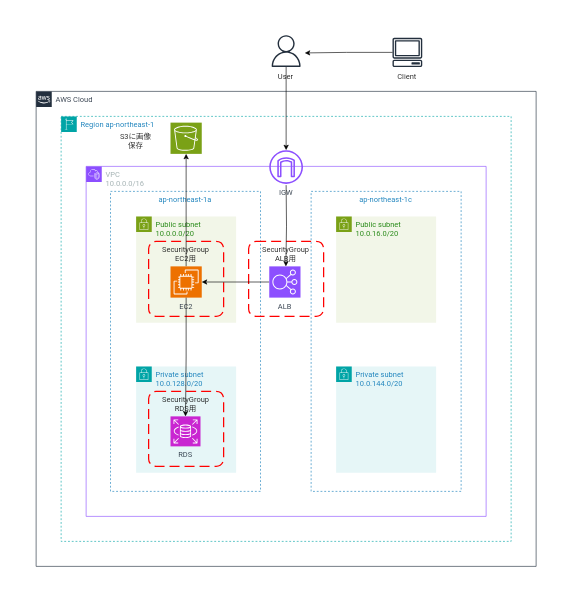

# おまけ:CLI削除コマンド
#### 以下の構成図のリソースを削除します
## 構成図



### ALB

1. ロードバランサーの削除
2. ターゲットグループの削除

### RDS

3. RDSの停止・RDSの削除
4. サブネットグループの削除
5. RDSに保存されたSecrets Managerの認証情報を削除

### EC2

6. EC2の削除
7. インスタンスプロファイルに関連付けられたIAMロールの削除
8. インスタンスプロファイルの削除
9. キーペアの削除

### SG

10. セキュリティグループの削除

### NETWORK

11. ルートテーブルからサブネットの関連付けを削除し、ルートテーブル・サブネットを削除する
12. IGWをVPCからデタッチし、IGWとVPCを削除
13. EC2にアタッチしたIAMロールとIAMポリシーの削除
14. S3バケットの削除

## ALB

1. ロードバランサーの削除

ロードバランサーの存在確認
```
aws elbv2 describe-load-balancers --names ${ELB_NAME}
```

削除したいELBNameを変数に指定し削除
```
ELB_NAME="tushiko-elb-cli"
#次のコマンドで削除
aws elbv2 delete-load-balancer \
--load-balancer-arn $(aws elbv2 describe-load-balancers --query "LoadBalancers[].LoadBalancerArn" --output text --names ${ELB_NAME})
#何も返ってこず、コマンドが実行されれば成功
```

2. ターゲットグループの削除
ターゲットグループの存在確認
```
aws elbv2 describe-target-groups --names ${TARGET_GROUP_NAME}
```

削除したいターゲットグループを変数に指定し削除
```
TARGET_GROUP_NAME="tushiko-target-cli"
#次のコマンドで削除
aws elbv2 delete-target-group \
--target-group-arn $(aws elbv2 describe-target-groups --query "TargetGroups[].TargetGroupArn" \--output text --name ${TARGET_GROUP_NAME})
#何も返ってこず、コマンドが実行されれば成功
```

## RDS

3. RDSの停止・RDSの削除

作成したRDSの確認コマンド
```
aws rds describe-db-instances　
```

作成したRDSを停止

作成したRDSIDを確認
```
aws rds describe-db-instances --query 'DBInstances[*].DBInstanceIdentifier'
```
停止したいRDSのDBインスタンスIDを変数化
```
RDS_ID="mydbinstance"
aws rds stop-db-instance --db-instance-identifier ${RDS_ID} 
```

スナップショットを作成せず、完全削除する場合
```　
aws rds delete-db-instance --db-instance-identifier ${RDS_ID} --skip-final-snapshot
```

スナップショットを作成して、削除する場合
スナップショットを変数化
```
RDS_SNAPSHOT_NAME="指定したいスナップショット名"
aws rds delete-db-instance --db-instance-identifier ${RDS_ID} --final-db-snapshot-identifier ${RDS_SNAPSHOT_NAME}
```

コンソール上でも確認

4. サブネットグループの削除
RDSのサブネットグループをサブネットグループ名に絞って表示させる場合

```
aws rds describe-db-subnet-groups --query 'DBSubnetGroups[*].DBSubnetGroupName'
```
削除したいサブネットグループを変数化し、削除。
```
"削除したいサブネットグループ名を指定"
RDS_SUBNET_GROUP_NAME="my-subnet-group"
aws rds delete-db-subnet-group --db-subnet-group-name ${RDS_SUBNET_GROUP_NAME}
#何も返ってこず、コマンドが実行されれば成功
```

削除しようとするサブネットグループが、まだアクティブなRDSインスタンスで使用されている場合は、削除できないので、RDSを削除してからコマンドを実行する

5. RDSに保存されたSecrets Managerの認証情報を削除
RDSに保存されたSecrets Managerの認証情報を取得する
全リストを確認する
```
aws secretsmanager list-secrets
```
特定の名称が入ったSecrets Manager名を取得する
```
#aws secretsmanager list-secrets --query 'SecretList[?contains(Name, `含めたい名称`)].Name'
#今回は、"secret"を指定
aws secretsmanager list-secrets --query 'SecretList[?contains(Name, `secret`)].Name'
```
シークレット情報に保存されたユーザ名・パスワード名を取得する
```
aws secretsmanager get-secret-value --secret-id <シークレットマネージャー名>
#今回は、"mydbsecret"を指定
aws secretsmanager get-secret-value --secret-id "mydbsecret"
```

シークレットマネージャーの認証情報を削除する
* 30日以内の復旧期間（デフォルト）を設定して、削除する

```
#シークレット名またはシークレットIDを変数に設定
#SECRETS_MANAGER_NAME="シークレット名"
aws secretsmanager delete-secret --secret-id ${SECRETS_MANAGER_NAME}
```

*即時で完全削除(復旧はできない)
```
#シークレット名またはシークレットIDを変数に設定
#SECRETS_MANAGER_NAME="シークレット名"
aws secretsmanager delete-secret --secret-id ${SECRETS_MANAGER_NAME} --force-delete-without-recovery
```
## EC2

6. EC2の削除

現在、稼働しているEC2インスタンスの名前とIDを取得する
```
aws ec2 describe-instances --query 'Reservations[*].Instances[*].[InstanceId, Tags[?Key==`Name`].Value]' --output text
```

指定したキーワードが特定のEC2インスタンスの名前とIDを取得する
```
#Values=*指定したキーワード*"を指定 
#今回は*cli*を指定
aws ec2 describe-instances --filters "Name=tag:Name,Values=*cli*" --query 'Reservations[*].Instances[*].[InstanceId, Tags[?Key==`Name`].Value]' --output text
```
EC2インスタンスの停止・削除
EC2インスタンスのIDを変数に指定
```
#EC2_INSTANCE_ID="指定したインスタンスIDを指定"
EC2_INSTANCE_ID=i-******************
```

EC2インスタンスの停止
```
aws ec2 stop-instances --instance-ids ${EC2_INSTANCE_ID}
```

EC2インスタンスの終了
```
aws ec2 terminate-instances --instance-ids ${EC2_INSTANCE_ID}
```

7. インスタンスプロファイルに関連付けられたIAMロールの削除

指定したIAMロールがどのインスタンスプロファイルアタッチされているかを確認

```
#aws iam list-instance-profiles-for-role --role-name <IAMロール名>
aws iam list-instance-profiles-for-role --role-name  tushiko-cli-role
```

インスタンスプロファイルに関連付けられたIAMロールの削除
```
#remove-role-from-instance-profileコマンドで、インスタンスプロファイルからIAMロールをデタッチ
#aws iam remove-role-from-instance-profile --instance-profile-name "<インスタンスプロファイル名>"  --role-name "<IAMロール名>"
aws iam remove-role-from-instance-profile --instance-profile-name "tushiko-cli-role-instance-profile"  --role-name tushiko-cli-role
```

8. インスタンスプロファイルの削除
```
#aws iam delete-instance-profile --instance-profile-name <インスタンスプロファイル名>
aws iam delete-instance-profile --instance-profile-name  "tushiko-cli-role-instance-profile"
```

9. キーペアの削除

作成したキーペアの全リストを取得する
```
aws ec2 describe-key-pairs
```

作成したキーペアの名前とIDのみを取得する
```
aws ec2 describe-key-pairs --query 'KeyPairs[*].[KeyName, KeyPairId]' --output text
```

キーペアIDを変数に指定し、キーペアを削除する
```
KEY_PAIR_ID="key-××××××××××××××××××"
aws ec2 delete-key-pair --key-pair-id ${KEY_PAIR_ID}
```
キーペア名を変数に指定し、キーペアを削除する
```
KEY_PAIR_NAME="キーペア名"
aws ec2 delete-key-pair --key-name ${KEY_PAIR_NAME}
```
## SG


10. セキュリティグループの削除

セキュリティグループ名とIDを取得するコマンド
```
 aws ec2 describe-security-groups --query "SecurityGroups[*].[GroupName,GroupId]" --output table
```

特定の名前がつくセキュリティグループの取得
```
「test」という名前がつくセキュリティグループを取得
aws ec2 describe-security-groups --filters Name=group-name,Values="*test*" --query "SecurityGroups[*].[GroupName,GroupId]" --output table
```

削除したいセキュリティグループを変数に設定
今回はEC2に関連付けたSGを削除
```
SECURITY_GROUP_ID1=sg-****************** 
aws ec2 delete-security-group --group-id ${SECURITY_GROUP_ID1}
```

同じようにRDS、ALBにも関連付けられたSGを削除
```
SECURITY_GROUP_ID2=sg-****************** 
aws ec2 delete-security-group --group-id ${SECURITY_GROUP_ID2}

SECURITY_GROUP_ID3=sg-****************** 
aws ec2 delete-security-group --group-id ${SECURITY_GROUP_ID3}
```

削除工程でRDSのSGのインバウンドルールにEC2のセキュリティグループの許可が設定されているため削除できず
```
aws ec2 delete-security-group --group-id ${SECURITY_GROUP_ID1}

An error occurred (DependencyViolation) when calling the DeleteSecurityGroup operation: resource sg-07daea686a97c95ed has a dependent object
```

RDSのセキュリティグループルールを変更または削除して再度実行
RDSのセキュリティグループのインバウンドルール3306のEC2のセキュリティグループを削除して再度実行する

各種変数を設定
```
EC2_SECURITY_GROUP_ID=sg-****************** ←RDSのセキュリティグループを指定
EC2_SECURITY_GROUP_RULE_PROTOCOL='tcp'
EC2_SECURITY_GROUP_RULE_PORT='3306'
EC2_SOURCE_SECURITY_GROUP_ID=sg-****************** ←EC2のセキュリティグループを指定
```

ルール変更を実行
```
aws ec2 revoke-security-group-ingress \
  --group-id ${EC2_SECURITY_GROUP_ID} \
  --protocol ${EC2_SECURITY_GROUP_RULE_PROTOCOL} \
  --port ${EC2_SECURITY_GROUP_RULE_PORT} \
  --source-group ${EC2_SOURCE_SECURITY_GROUP_ID}
#tureが返ってくれば、成功
```

エラー原因が他のRDSに削除しようとしていたSGが関連付けられていたため削除できず
RDSを削除して、

あとは、通常通り削除すればOK

## NETWORK

11.ルートテーブルからサブネットの関連付けを削除し、ルートテーブル・サブネットを削除する

ルートテーブルの名前を取得する
```
aws ec2 describe-route-tables --query "RouteTables[*].{RouteTableId:RouteTableId,Name:Tags[?Key=='Name'].Value | [0]}" --output table
#以下が取得されればOK
------------------------------------------------------------------------
|                          DescribeRouteTables                         |
+--------------------------------------------+-------------------------+
|                    Name                    |      RouteTableId       |
+--------------------------------------------+-------------------------+
|  　　　　　　　　　　　　　　              |  rtb-                   |
+--------------------------------------------+-------------------------+
```
対象の(今回はサブネットの関連付けを削除したい)ルートテーブルIDを変数化
```
ROUTE_TABLE_ID=rtb-××××××××××××××××××
```

対象のルートテーブルIDがどのサブネットに関連付けられているかを確認
```
aws ec2 describe-route-tables --route-table-ids ${ROUTE_TABLE_ID} --query "RouteTables[*].Associations[*].SubnetId" --output text
#subnet-**********が出ればOK
```

ASSOCIATION_IDを取得
```
aws ec2 describe-route-tables --route-table-ids ${ROUTE_TABLE_ID} --query "RouteTables[*].Associations[*].RouteTableAssociationId" --output text
```

対象の(今回はルートテーブルとの関連付けを削除したい)Association-IDを変数化
```
ASSOCIATION_ID=rtbassoc-××××××××××
```

サブネットからルートテーブルのデタッチ（関連解除）
```
aws ec2 disassociate-route-table --association-id ${ASSOCIATION_ID}
```

サブネットを削除
削除したいSUBNET_IDを変数に指定
```
SUBNET_ID=subnet-**********
```

以下のコマンドでサブネットを削除
```
aws ec2 delete-subnet --subnet-id ${SUBNET_ID}
```
ルートテーブルを削除
以下のコマンドでルートテーブルを削除
```
aws ec2 delete-route-table --route-table-id ${ROUTE_TABLE_ID}
```

参考　ルートテーブルIDを変数で指定したあと、サブネットID・AssociationIDを同時に取得する
```
aws ec2 describe-route-tables --route-table-ids ${ROUTE_TABLE_ID2} --query "RouteTables[*].Associations[*].{AssociationId:RouteTableAssociationId, SubnetId:SubnetId}" --output table
```

IGWをVPCからデタッチし、IGWとVPCを削除する
IGW名とIGWIDを取得する

```
aws ec2 describe-internet-gateways --query "InternetGateways[*].{ID:InternetGatewayId,Name:Tags[?Key=='Name'].Value | [0]}" --output table
-----------------------------------------------------------
|                 DescribeInternetGateways                 |
+------------------------+---------------------------------+
|           ID           |              Name               |
+------------------------+---------------------------------+
|  igw-                  |  　　　　　　　                 |
+------------------------+---------------------------------+
```

VPCからデタッチしたいIGWIDを変数化する
```
IGW_ID=igw-******************  
```

取得したIGW名とIGWIDがどのVPCにアタッチされているかを確認する
```
aws ec2 describe-internet-gateways --internet-gateway-ids ${IGW_ID} --query "InternetGateways[*].Attachments[*].VpcId" --output text
```

削除したいVPCを変数化する
``` 
VPC_ID=vpc-******************
```

IGWをVPCからデタッチする
```
aws ec2 detach-internet-gateway --internet-gateway-id ${IGW_ID} --vpc-id ${VPC_ID}
```

IGWとVPCを削除する
```
#IGWを削除する
aws ec2 delete-internet-gateway --internet-gateway-id ${IGW_ID}
#VPCを削除する
aws ec2 delete-vpc --vpc-id ${VPC_ID}
```

IAMロールを削除する
* 削除したいIAMロールをリストで確認する
```
aws iam list-roles --query "Roles[*].{RoleName:RoleName, RoleId:RoleId}" --output table
-------------------------------------------------------------------------
|                               ListRoles                               |
+------------------------+----------------------------------------------+
|         RoleId         |                  RoleName                    |
+------------------------+----------------------------------------------+
|                        |                                              |
+------------------------+----------------------------------------------+
```
削除したいIAMロールを変数に指定する
```
ROLE_NAME=************
```
IAMロールのインラインポリシーの取得

ロールに関連付けられているインラインポリシーを削除
インラインポリシーの有無を確認
```
aws iam list-role-policies --role-name ${ROLE_NAME}

#下記の表記が出ることを確認
{
    "PolicyNames": [
        "インラインポリシー名"
    ]
}
```

インラインポリシーを変数に指定する
```
POLICY_NAME="インラインポリシー名"`
```

以下のコマンドで、ロールに関連付けられているインラインポリシーを削除
```
aws iam delete-role-policy --role-name ${ROLE_NAME} --policy-name ${POLICY_NAME}
```
IAMロールの削除
すべてのポリシーがアタッチされていないことを確認し、以下のコマンドで削除
```
aws iam delete-role --role-name ${ROLE_NAME}
```

14. S3バケットの削除

* S3バケットのリストをテーブル式で表示
```
aws s3 ls --output table
```
* 削除したいS3バケット指定し、削除。
```
aws s3 rb s3://<バケット名>
```

* --forceオプションでオブジェクトが入っている状態でも強制削除
```
aws s3 rb s3://<バケット名> --force
```

#### 前回まではこちら

[CLIをインストール](../cLI-command/cli-install.md)

[VPC環境を作成](../cLI-command/cli-command-network.md)

[SGを作成](../cLI-command/cli-command-SG.md)

[S3・EC2の作成](../cLI-command/cli-command-S3-EC2.md)

[ALBの作成](../cLI-command/cli-command-ALB.md)

[RDSの作成](../cLI-command/cli-command-RDS.md)