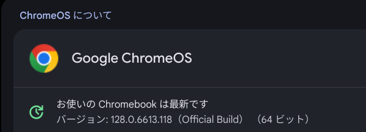
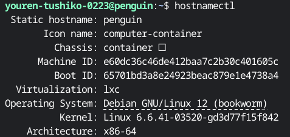
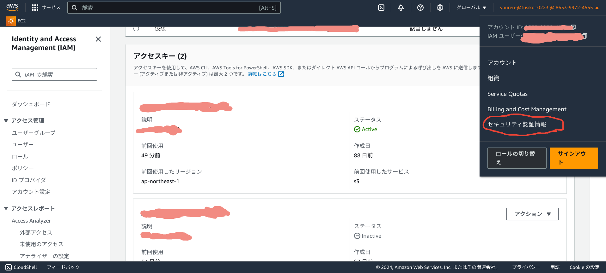
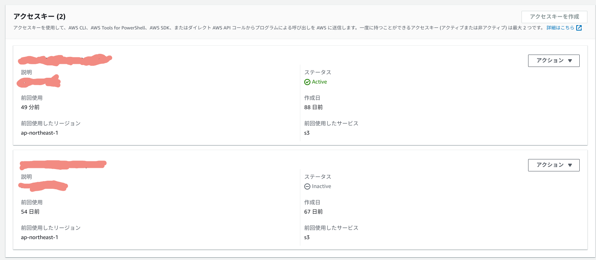
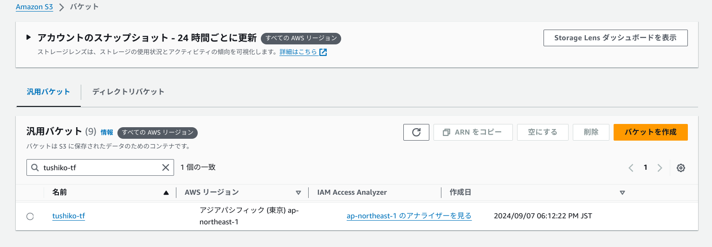
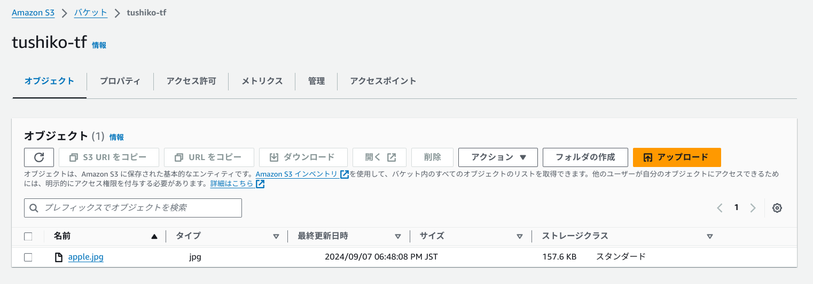
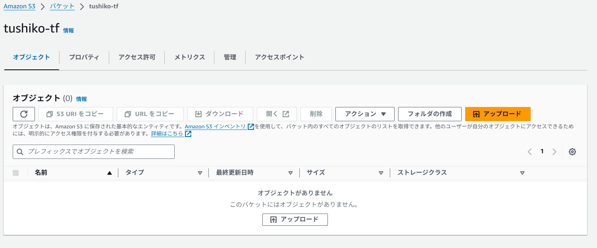
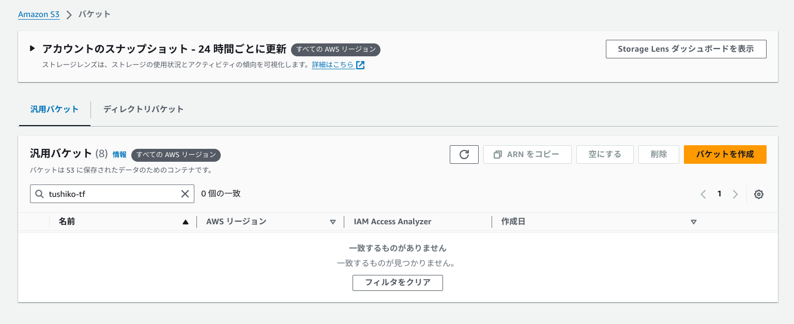

# CLIをインストール&動作確認

* 使用しているPC及びターミナルのOS
   * 使用しているPC Chromebook OS バージョン: 128.0.6613.118（Official Build） （64 ビット）2024年9月6日現在
   * LinuxOS Debian系　Debian GNU/Linux 12 (bookworm)　Architecture: x86-64 2024年9月6日現在
  
   
   

* CLI操作に関して、必要なもの
   * CLI操作できるポリシーをIAMユーザーにアタッチ
   * 今回は、"AdministratorAccess"ポリシー付与のIAMユーザーを使用します
   * IAMユーザーで作成したアクセスキーとシークレットアクセスキー　(認証情報を登録する際に使用します)
     
## CLIをインストール
[公式サイト](https://docs.aws.amazon.com/ja_jp/cli/latest/userguide/getting-started-install.html)を元にインストール

```
#curlコマンドにてインストール
curl "https://awscli.amazonaws.com/awscli-exe-linux-x86_64.zip" -o "awscliv2.zip"
#インストーラを解凍
unzip awscliv2.zip
#新しく解凍されたinstallディレクトリにあるawsファイルにてインストールプログラムを実行
sudo ./aws/install
#CLIのインストールを確認。バージョンが出ればOK
aws --version
```


* 認証情報「credentials」を設定
```
#隠しディレクトリ".aws"の有無を確認
#隠しディレクトリなのでcdコマンドで確認
cd .aws
ls
├── credentials　config
```

## 認証情報を設定する
* マネジメントコンソール右上の"myアカウント”から"セキュリティ認証情報を選択"、"AWS IAM認証情報"から"アクセスキーの作成及び有効化"されているか確認
* 作成されていない・またはアクセスキー・シークレットアクセスキーを紛失した場合は再作成を行ってください




* credentialsに"アクセスキー”、”シークレットアクセスキー"を設定する
```
vi credentials
#credentialsファイルに記述
[default]
aws_access_key_id = "取得したアクセスキーID"
aws_secret_access_key = ”取得したシークレットアクセスキーID"
```

* configに"region"と"output"を設定する
```
vi config
#configファイルに記述
[default]
region = ap-northeast-1 #regionを東京に設定
output = json
```

* CLIコマンドで自分のアカウントが表示されるかを確認する
```
aws sts get-caller-identity
{
    "UserId":"××××-××××-××××"<AWS側で設定された12桁の番号>,
    "Account": "自身で設定したアカウント名",
    "Arn": "arn:aws:iam::<UseId名>:user/<Account名>"
}
```


以下が表示されていればOK！

## 実際にコマンドを入力しAWS上にリソースが作られてるか確認
* S3バケット作成
* オブジェクトがバケットにアップロードされるか確認
* オブジェクトをバケットから削除されることを確認
* S3バケットの削除を確認

#### S3バケットを作成(バケット名は既存のバケット名以外のバケット名を設定する)
* 既存のバケット名(sample.bucket)で作成すると以下のエラーが表示


```
#"tushiko-tf"でバケット作成
aws s3 mb s3://tushiko-tf
```


実際に確認


#### オブジェクトがバケットにアップロードされるかを確認
```
#オブジェクト"apple.jpg"を"tushiko-tf"バケットにアップロード
aws s3 cp apple.jpg s3://tushiko-tf
```


実際に確認


#### オブジェクトをバケットから削除されることを確認
```
#オブジェクト"apple.jpg"を"tushiko-tf"バケットから削除
aws s3 rm apple.jpg s3://tushiko-tf
```


実際に確認


#### S3バケットの削除を確認
```
#"tushiko-tf"バケットを削除
aws s3 rb s3://tushiko-tf
```


実際に確認


参照
CLIでAWSリソースを作成する


